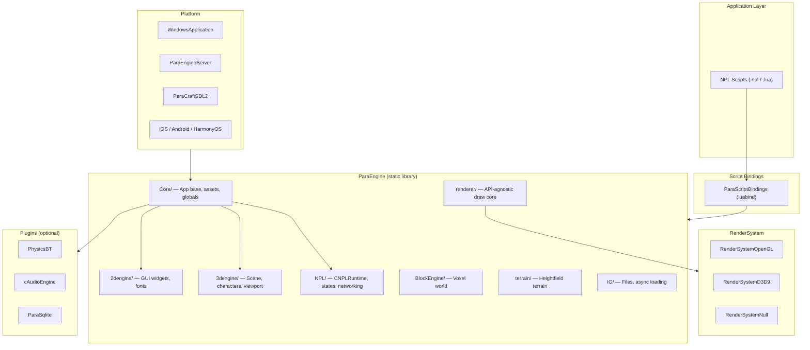

# Architecture Overview

This document describes the high-level architecture of NPLRuntime and ParaEngine — how major layers connect, how data flows at runtime, and how client and server builds differ.

## System Purpose

NPLRuntime combines three concerns in one codebase:

1. **NPL runtime** — A message-driven, multi-threaded Lua 5.1 scripting environment with distributed activation (local threads and remote TCP/UDP peers).
2. **ParaEngine** — A full game engine: 3D scene graph, 2D GUI, terrain, voxel blocks, asset pipeline, audio/physics hooks.
3. **Platform shells** — OS-specific entry points that wire windowing, input, and GPU context into the shared engine core.

Applications like Paracraft are primarily NPL scripts running on top of this C++ stack.

## Layered Architecture



## Build-Time Composition

CMake assembles the tree in this order (`NPLRuntime/CMakeLists.txt`):

```
externals → Plugins → ParaEngine → RenderSystem → Platform
```

| Layer | CMake target | Always built? |
|-------|--------------|---------------|
| ParaEngine | `ParaEngine` | Yes (static library) |
| RenderSystem | `RenderSystemOpenGL` / `D3D9` / `Null` | One backend per `NPLRUNTIME_RENDERER` |
| Platform | `WindowsApplication`, `ParaEngineServer`, etc. | One per platform flags |
| Plugins | `PhysicsBT`, `cAudioEngine`, `ParaSqlite`, … | Conditional |

The **same ParaEngine library** is linked into both client and server; differences come from CMake options (renderer, plugins, platform target).

## Runtime Data Flow (Client)

```
1. Platform main() / WinMain()
       ↓
2. CParaEngineAppBase::InitApp()
   ├── FindParaEngineDirectory()     — locate asset root
   ├── BootStrapAndLoadConfig()      — load config/*.xml, pkg archives
   ├── InitSystemModules()           — NPL, assets, scene, GUI
   └── InitRenderEnvironment()       — create IRenderDevice
       ↓
3. CParaEngineAppBase::StartApp()
   └── NPL.activate initial script
       ↓
4. Frame loop: CParaEngineAppBase::FrameMove(fTime)
   ├── CNPLRuntime::Run()            — process NPL messages, timers
   ├── Scene update (Animate, physics)
   ├── GUI update
   └── Render()                      — viewport draw via RenderSystem
       ↓
5. Shutdown: StopApp() → Cleanup()
```

### Server variant

Server builds use `CParaEngineServerApp` + `CParaEngineService`:

- `NPLRUNTIME_RENDERER=NULL` — no GPU
- `SetHostMainStatesInFrameMove(false)` — main NPL states run on worker threads
- Driven by `boost::asio` timer instead of render loop
- Entry: `Platform/Linux/src/ParaEngineServer.cpp` → `main()`

## Client vs Server Comparison

| Aspect | Client | Server |
|--------|--------|--------|
| CMake flag | default | `NPLRUNTIME_SERVER=ON` |
| Renderer | OPENGL or DIRECTX | NULL |
| Platform target | Windows / SDL / mobile | `ParaEngineServer` (Linux/mac) |
| Physics / Audio / FBX | On by default | Off by default |
| NPL main states | Processed in `FrameMove` | Worker threads (`Run_Async`) |
| Typical CLI | `npl script.npl` | `npls script.npl` |
| Output binary | `ParaEngineClient.exe` | `ParaEngineServer` |

## NPL Activation Flow

NPL scripts communicate via **activation** — sending a message to a named neuron file:

```
Caller thread
    └── CNPLRuntime::NPL_Activate(filename, msg)
            ├── Parse NPLFileName → (runtimeState)path[@dns]
            ├── Local? → CNPLRuntimeState::Activate_async (queue message)
            └── Remote? → CNPLDispatcher → CNPLNetServer (TCP) / UDP server
                    ↓
Target CNPLRuntimeState
    └── Process message queue → invoke this(msg) handler in Lua
```

Neuron file naming convention:

```
(runtimeState|gl)[nid:]path[@dnsRecord]
```

Examples:

| Activation target | Meaning |
|-------------------|---------|
| `(gl)main.npl` | Main/global runtime state |
| `(worker1)tasks/process.npl` | Named worker thread state |
| `(192.168.1.1:8080)remote.npl` | Remote NPL peer |

See [npl-runtime.md](npl-runtime.md) for full detail.

## Asset Pipeline

`CParaWorldAsset` (`ParaEngine/Core/ParaWorldAsset.h`) is the central asset hub:

```
Script / C++ request
    └── CParaWorldAsset::GetTexture() / GetParaXModel() / …
            ├── Lookup by file path (primary key)
            ├── Lazy load from disk or .pkg archive
            ├── Reference count via asset_ptr<T>
            └── Sub-managers: TextureAssetManager, EffectManager, BlockMaterialManager, …
```

Device-lost handling: GPU-backed assets implement `InitDeviceObjects` / `RestoreDeviceObjects` / `InvalidateDeviceObjects` / `DeleteDeviceObjects` and are automatically restored on context recreation.

## Scene and Rendering Pipeline

```
CSceneObject (singleton via CGlobals)
    ├── Quad-tree spatial partition
    ├── CBaseObject / IGameObject hierarchy
    └── FrameMove: Animate() → culling → Draw()
            ↓
CViewportManager
    └── Per-viewport render pass
            ↓
renderer/RenderCore (API-agnostic)
    └── RenderSystem: RenderDeviceOpenGL | RenderDeviceD3D9
```

2D GUI (`2dengine/GUIRoot`) renders on top via the same device, using `PaintEngine` for vector/raster drawing.

## Threading Model

| Thread | Responsibility |
|--------|----------------|
| Main / game thread | Frame loop, render, input, NPL `Process()` for hosted states |
| NPL worker threads | One per named `CNPLRuntimeState` (e.g. `(worker1)`) |
| NPL net I/O | TCP accept + read threads in `CNPLNetServer` |
| Async file loader | Background asset loading (optional, `IsAsyncLoading`) |

Emscripten builds can use `EMSCRIPTEN_SINGLE_THREAD` to replace Boost.Thread with coroutines (`util/CoroutineThread.h`).

## Legacy Server Tree

`Server/trunk/` at the repository root is an **older standalone server** with its own vendored Lua, curl, and sqlite. Modern development should use:

```bash
cmake -S NPLRuntime -B build -DNPLRUNTIME_SERVER=ON
```

The unified `NPLRuntime/` tree shares ParaEngine with the client and is the maintained path.

## Key Design Patterns

### Singletons via CGlobals

Most engine services are accessed through `CGlobals` static accessors or dedicated `GetInstance()` / `GetSingleton()` methods. Avoid creating duplicate managers.

### Intrusive reference counting

Assets and many engine objects use `boost::intrusive_ptr` via aliases `asset_ptr<T>` and `ref_ptr<T>`. Base classes derive from `intrusive_ptr_thread_safe_base` or `intrusive_ptr_single_thread_base`.

### Attribute fields (reflection)

Many classes implement `IAttributeFields` with `InstallFields()` — this powers the in-engine inspector, serialization, and NPL attribute API (`obj:GetField("name")`).

### Device lifecycle

All GPU resources follow the DirectX-style four-phase lifecycle called from `CParaEngineAppBase`:

- `InitDeviceObjects`
- `RestoreDeviceObjects`
- `InvalidateDeviceObjects`
- `DeleteDeviceObjects`

## Directory Map (Engine Core)

| Path | Role |
|------|------|
| `ParaEngine/NPL/` | Script runtime, networking, dispatcher |
| `ParaEngine/Core/` | App lifecycle, assets, events, service loop |
| `ParaEngine/Framework/` | Public interfaces (`IParaEngineApp`, `IRenderDevice`, …) |
| `ParaEngine/ParaScriptBindings/` | Lua/NPL C++ API surface |
| `ParaEngine/3dengine/` | Scene graph, characters, viewports |
| `ParaEngine/2dengine/` | GUI system |
| `ParaEngine/PaintEngine/` | 2D painter |
| `ParaEngine/renderer/` | Render-API-agnostic draw helpers |
| `ParaEngine/BlockEngine/` | Voxel/block world |
| `ParaEngine/terrain/` | Heightfield terrain with LOD |
| `ParaEngine/ParaXModel/` | ParaX animated model format |
| `ParaEngine/BMaxModel/` | Block max voxel model format |
| `ParaEngine/IO/` | Serial ports, filesystem watcher |
| `ParaEngine/WebSocket/` | WebSocket client/server |
| `ParaEngine/Engine/` | DirectX-only systems (HTML browser, DB providers, voxel mesh) |

See [paraengine-subsystems.md](paraengine-subsystems.md) for per-module detail.

## Further Reading

- [build-system.md](build-system.md) — CMake targets and options
- [npl-runtime.md](npl-runtime.md) — CNPLRuntime internals
- [render-system.md](render-system.md) — GPU backends
- [platform.md](platform.md) — OS entry points
- [conventions.md](conventions.md) — coding standards
