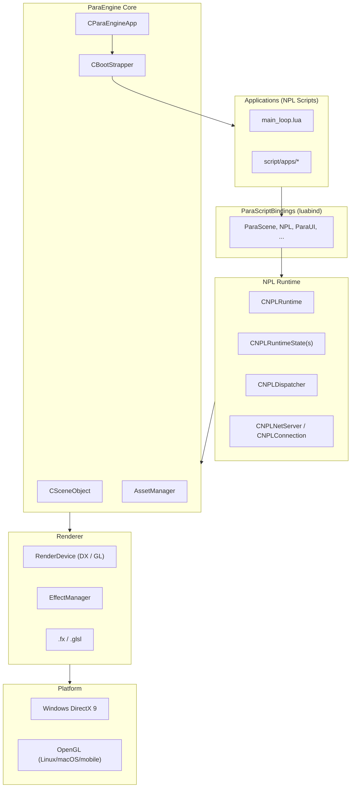

# Architecture Overview

NPLRuntime is a monorepo containing **ParaEngine** (3D/2D game engine) and the **NPL (Neural Parallel Language)** runtime. The engine is written in C++11 and scripted in Lua-compatible NPL.

## Design Goals

NPL was designed (2004) for:

- Multi-threaded, distributed computation across networked machines
- Neural network algorithms, 3D simulation, and visualization
- Lua/C++ affinity with async message-passing instead of shared mutable state

ParaEngine provides the rendering, asset, physics, and GUI layers on top of this runtime.

## High-Level Architecture



## Dual Build Paths

The same C++ sources under `Client/trunk/ParaEngineClient/` compile into two products:

| Build | CMake Root | Target | Output | Use Case |
|-------|-----------|--------|--------|----------|
| **Client** | `Client/CMakeLists.txt` | `ParaEngineClient` | `npl` | Full 3D GUI game client |
| **Server** | `NPLRuntime/CMakeLists.txt` | `ParaEngineServer` | `npls` | Headless multiplayer backend, services |

### Client vs Server Source Differences

**Shared (both builds):**
- `Core/`, `NPL/`, `3dengine/`, `2dengine/`, `renderer/`
- `ParaScriptBindings/`, `terrain/`, `BlockEngine/`, `IO/`, `math/`, `util/`
- `WebSocket/`, `protocol/`, `Framework/`, `AutoRigger/`

**Client-only:**
- Full `Engine/` (game logic, character DB, touch input)
- `CommonFramework/`, `common/` (DirectX utilities)
- `WebBrowser/`, full shader compilation pipeline (`fxc`)
- Platform window code, audio plugins, physics plugins

**Server-only entry:**
- `Engine/ParaEngineServer.cpp` + `Engine/ParaXStaticBase.cpp`

## Application Lifecycle

### Client Boot Sequence

1. **Entry:** `WinMain()` in `Engine/ParaWorld.cpp` (or `mac_main.cpp` on macOS)
2. **Parse CLI:** `CCommandLineParams` reads name/value pairs (`bootstrapper=...`, resolution, etc.)
3. **Init engine:** `CParaEngineApp::Init()` → `OneTimeSceneInit()`
   - NPL runtime initialization
   - Asset manager, scene root creation
   - Lua API bindings loaded via `LoadHAPI_*()` functions
4. **Graphics init:** `InitDeviceObjects()` / `RestoreDeviceObjects()` — create DirectX/OpenGL device
5. **Bootstrap:** `CBootStrapper` loads XML bootstrapper → sets main loop script path
6. **Main loop:** Every ~0.5s, activates the main loop NPL script; frame rendering on `(main)` runtime state

### Server Boot Sequence

1. **Entry:** `main()` in `Engine/ParaEngineServer.cpp`
2. **Flags:** `-d` daemon mode, `-i` interpreter mode, `-D` disable daemon
3. **Service loop:** `CParaEngineService::Run()` — Boost.Asio timer (50ms) drives NPL message processing
4. No window, no rendering device (OpenGL may still link for shared code paths)

## Core Singletons

| Singleton | Access | Role |
|-----------|--------|------|
| `CNPLRuntime::GetInstance()` | `CGlobals::GetNPLRuntime()` | NPL runtime, networking, activation |
| `CSceneObject::GetInstance()` | Scene root | All 3D objects, terrain, camera, AI |
| `CParaEngineAppBase::GetInstance()` | Current app | Application state, device, window |
| `CGlobals` | Various static accessors | Asset manager, config, file system |

## Layer Responsibilities

### Layer 1: Platform & I/O
- `Core/` — Application framework, plugins, command line, file I/O
- `IO/` — Virtual file system, zip archives, async asset loading
- `util/` — Logging, threading, mutexes, string utilities
- `platform/` — OS-specific code (win32, mac)

### Layer 2: NPL Runtime
- Message-driven scripting with isolated Lua states per thread
- TCP/UDP networking with NID-based addressing
- See [npl-runtime.md](npl-runtime.md)

### Layer 3: Engine Subsystems
- Scene graph, 3D objects, terrain, block world, voxel mesh
- 2D GUI, input handling
- See [scene-graph-and-3d-engine.md](scene-graph-and-3d-engine.md)

### Layer 4: Rendering
- Abstract render device with DirectX 9 and OpenGL backends
- Effect/shader management, sprite batching
- See [renderer.md](renderer.md)

### Layer 5: Script Interface
- luabind-generated Lua API
- See [script-bindings.md](script-bindings.md)

## Multi-Runtime State Model

NPL supports multiple parallel runtime states (threads), each with its own Lua state and message queue:

```
CNPLRuntime
├── CNPLRuntimeState "(main)"     ← rendering + primary script logic (client)
├── CNPLRuntimeState "worker1"    ← background processing
├── CNPLRuntimeState "workerN"    ← additional workers
└── CNPLDispatcher                ← routes messages between states and network
```

Messages flow:
- **Local:** `NPL.activate()` → runtime state input queue → `this(msg)` handler
- **Remote:** `NPL.activate(nid, file, data)` → dispatcher → TCP connection → remote runtime state

## Plugin Architecture

ParaEngine supports dynamic plugins:

| Plugin | Location | Purpose |
|--------|----------|---------|
| `NPLMono2` | `Server/trunk/NPLMono/NPLMono2/` | Mono/.NET scripting |
| `NPLRouter` | `Server/trunk/NPLRouter/` | Message router / DB proxy |
| `PhysicsBT` | `Client/trunk/PhysicsBT/` | Bullet3 physics |
| `cAudio` | `Client/trunk/cAudio_2.4.0/` | Audio engine |
| C++ DLL plugins | Any | `NPL.activate("MyPlugin.dll", ...)` |

Plugins are loaded via `PluginAPI.h` and registered at runtime.

## Asset Pipeline

```
File on disk / zip archive
    → IO/VirtualFileSystem
    → AssetManager (Core/AssetManager.h)
    → AssetEntity<T> (reference counted)
    → Scene object (ParaXEntity, TextureEntity, etc.)
```

Supported formats:
- **ParaX** — native skeletal animation format (`ParaXModel/`)
- **FBX/OBJ/glTF** — via Assimp (`ParaXModel/ColladaModelLoader.cpp`, etc.)
- **BMax** — Blender export format (`BMaxModel/`)
- **MDX** — legacy Warcraft-style models (`mdxfile/`, partially deprecated)
- **Block data** — Minecraft-style voxels (`BlockEngine/`)

## Network Architecture

NPL networking uses a custom protocol over TCP:

- Each runtime instance has a globally unique **NID** (network identity)
- Messages have HTTP-like headers + JSON body (see `NPL/NPLMsgIn_parser.h`)
- Public file lists control which scripts are remotely activatable
- Authentication is application-level (NPL provides transport, not auth)

Detailed flow: [npl-runtime.md](npl-runtime.md#network-message-flow).

## Configuration

- **Bootstrapper XML:** Specifies main loop script (`<MainGameLoop>(gl)script/apps/...</MainGameLoop>`)
- **Command line:** Name/value pairs override defaults (resolution, bootstrapper path, etc.)
- **Config namespace:** Lua `Config` API for runtime settings
- **Legacy defaults:** `Client/trunk/ParaEngineClient/doc/config.txt`

## Output Layout

Built binaries land in `ParaWorld/`:

```
ParaWorld/
├── bin32/          # 32-bit builds
│   ├── ParaEngineClient.exe (or .dll)
│   └── ParaEngineServer.exe
└── bin64/          # 64-bit builds
    ├── ParaEngineClient
    └── ParaEngineServer  (symlinked as /usr/local/bin/npl on Linux)
```

Scripts, assets, and bootstrapper files are deployed alongside binaries in full installations.
