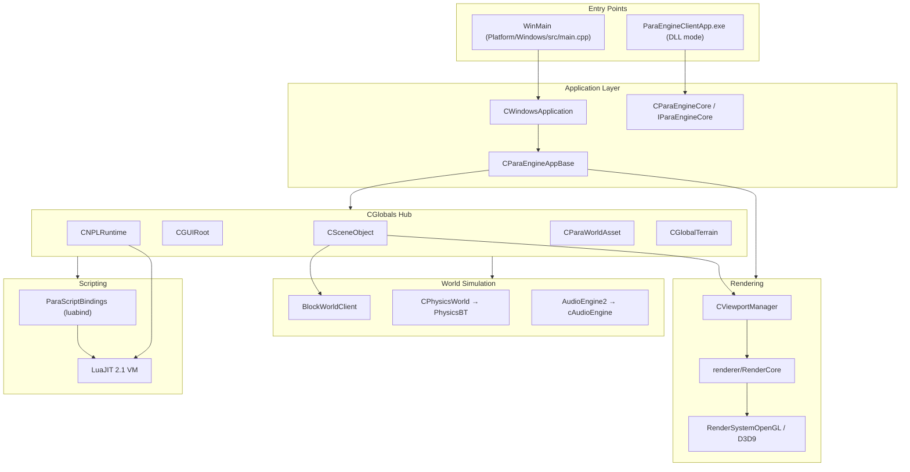

# ParaEngineClient — Deep Reference

This document is the detailed guide to the **ParaEngineClient** codebase — the C++ client engine historically located at `Client/trunk/ParaEngineClient/`. In this repository (`cp_old` branch layout), the same code lives under `NPLRuntime/` with `ParaEngine/` as the engine core.

> **Note:** The physical folder `Client/trunk/ParaEngineClient/` is **not present** in this workspace. All references below map legacy paths to their modern equivalents.

## Historical Context

ParaEngineClient was the Windows-centric client build of NPLRuntime, dating from ~2004–2010 (original `WinMain` in `Platform/Windows/src/main.cpp` is dated 2004.3.8). The wiki and older CMake files still refer to:

```
Client/trunk/ParaEngineClient/
├── ParaEngine/          ← engine static library source
├── Platform/            ← OS shells (Win32, etc.)
├── RenderSystem/        ← GPU backends
├── Plugins/             ← physics, audio, sqlite
├── externals/           ← vendored deps
├── ParaEngineClientApp/ ← thin EXE loading engine as DLL
└── CMakeLists.txt       ← client entry (vs Server/trunk for server)
```

The modern unified tree flattens this under `NPLRuntime/`:

```
NPLRuntime/
├── ParaEngine/          ← same internal layout as old ParaEngineClient/ParaEngine/
├── Platform/Windows/    ← was Platform/Win32 or similar
├── RenderSystem/
├── Plugins/
├── externals/
├── ParaEngineClientApp/
└── CMakeLists.txt       ← single root for client AND server
```

---

## Legacy → Modern Path Mapping

| Legacy path | Modern path | Change |
|-------------|-------------|--------|
| `Client/trunk/ParaEngineClient/` | `NPLRuntime/` | Repo re-root |
| `Client/trunk/ParaEngineClient/ParaEngine/` | `NPLRuntime/ParaEngine/` | **1:1 folder names preserved** |
| `Client/trunk/ParaEngineClient/ParaEngine/Core/` | `NPLRuntime/ParaEngine/Core/` | Unchanged |
| `Client/trunk/ParaEngineClient/ParaEngine/3dengine/` | `NPLRuntime/ParaEngine/3dengine/` | Unchanged |
| `Client/trunk/ParaEngineClient/ParaEngine/NPL/` | `NPLRuntime/ParaEngine/NPL/` | Unchanged |
| `Client/trunk/ParaEngineClient/Platform/Win32/` | `NPLRuntime/Platform/Windows/` | Renamed |
| `Client/trunk/ParaEngineClient/RenderSystem/` | `NPLRuntime/RenderSystem/` | Now sibling, not nested |
| `Client/trunk/ParaEngineClient/Plugins/` | `NPLRuntime/Plugins/` | Sibling |
| `Client/CMakeLists.txt` | `NPLRuntime/CMakeLists.txt` | Unified with server |
| `bin/Client/` or `bin/ClientOpenGL/` | `build/win32/` → `ParaWorld/bin64/` | Build output moved |
| `Server/trunk/NPLRuntime/` | `NPLRuntime/` + `-DNPLRUNTIME_SERVER=ON` | Server unified |

CMake variable **`ParaEngineClient_SOURCE_DIR`** still appears in plugin CMake files but now resolves to `NPLRuntime/ParaEngine/`:

```cmake
# NPLRuntime/ParaEngineClientApp/CMakeLists.txt
set(ParaEngineClient_SOURCE_DIR ${PROJECT_SOURCE_DIR}/../ParaEngine)
```

**Stale references** (need updating for out-of-tree builds):

- `Server/trunk/sqlite-3.6.23.1/CMakeLists.txt` → `Client/trunk/ParaEngineClient/`
- `NPLRuntime/Platform/HarmonyOS/entry/src/main/cpp/CMakeLists.txt` → globs `Client/trunk/ParaEngineClient/*.cpp`
- `NPLRuntime/RenderSystem/opengl/CMakeLists.txt` → `${PROJECT_SOURCE_DIR}/ParaEngineClient/ParaEngine/`

---

## Build Targets (Client)

| CMake target | Source location | Output | When built |
|--------------|-----------------|--------|------------|
| `ParaEngine` | `ParaEngine/CMakeLists.txt` | `ParaEngine.lib` (static) | Always |
| `RenderSystemOpenGL` | `RenderSystem/opengl/` | Static lib | `NPLRUNTIME_RENDERER=OPENGL` |
| `RenderSystemD3D9` | `RenderSystem/d3d9/` | Static lib | `NPLRUNTIME_RENDERER=DIRECTX` |
| `WindowsApplication` | `Platform/Windows/` | **`ParaEngineClient.exe`** | `WIN32` client |
| `ParaEngineClientApp` | `ParaEngineClientApp/` | **`ParaEngineClient.exe`** (harness) | `PARAENGINE_CLIENT_DLL=ON` |
| `PhysicsBT` | `Plugins/PhysicsBT/` | DLL or static | `NPLRUNTIME_PHYSICS=ON` |
| `cAudioEngine` | `Plugins/cAudioEngine/` | DLL or static | `NPLRUNTIME_AUDIO=ON` |
| `ParaSqlite` | `Plugins/sqlite3/` | Always built | Always |

Debug builds append `_d` (e.g. `ParaEngineClient_d.exe`, `ParaEngine_Debug.lib`).

Legacy in-tree build artifacts exist at `bin/ClientOpenGL/` (Visual Studio tlogs, `.obj`, `.recipe`) — this is **build output**, not source.

---

## Runtime Architecture (Client)



---

## Startup Sequence (Detailed)

From `CParaEngineAppBase::InitApp()` through first rendered frame:

```
1. Platform entry
   WinMain → CWindowsApplication(hInst)
   → RenderWindowDelegate (HWND holder)
   → InitApp(&renderWindow, lpCmdLine)

2. FindParaEngineDirectory()
   Walk up from executable to locate app root:
   - config/ folder
   - *.pkg package files
   - paraengine.sig

3. BootStrapAndLoadConfig()  [Core/BootStrapper.cpp]
   - Parse config/*.xml
   - Mount .pkg zip archives via CFileManager
   - Load engine settings (ParaEngineSettings)

4. InitSystemModules()
   - CNPLRuntime::Init()
   - CParaWorldAsset::GetSingleton() — asset managers
   - CSceneObject — 3D scene root
   - CGUIRoot — 2D GUI root
   - Plugin init (physics, audio if linked)
   - ParaScriptBindings — register all Lua APIs

5. InitRenderEnvironment()
   - Create IRenderDevice (WGL or D3D9 context)
   - InitDeviceObjects() on all GPU resources

6. StartApp()
   - NPL.activate bootstrap script (from config or cmdline)
   - Typical: activate main.npl or paracraft entry

7. Main loop (CWindowsApplication::Run)
   Each message/timer tick:
   → DoWork() / FrameMove(fTime)
      a. CNPLRuntime::Run(false)  — NPL messages, timers
      b. Scene Animate(fTime)     — animation, AI, physics step
      c. GUI update
      d. CalculateRenderTime()    — FPS cap, focus throttle
      e. Render() if render tick
         - CViewportManager::Render()
         - CSceneObject::Draw()
         - CGUIRoot::Draw()
   → Present / swap buffers

8. Shutdown
   StopApp() → InvalidateDeviceObjects → DeleteDeviceObjects
   → CNPLRuntime::Cleanup()
```

Server mode skips steps 5e (render) and uses `CParaEngineService` with Boost.Asio timer instead of Win32 message pump.

---

## ParaEngine/ — Module-by-Module Deep Dive

All paths relative to `NPLRuntime/ParaEngine/`.

### Core/ — Foundation

The heart of the engine. Everything else hangs off Core.

| File | Class | Responsibility |
|------|-------|----------------|
| `ParaEngineAppBase.h/.cpp` | `CParaEngineAppBase` | Shared client/server app: Init, FrameMove, device lifecycle, input |
| `ParaEngineServerApp.h/.cpp` | `CParaEngineServerApp` | Headless server variant |
| `ParaEngineService.h/.cpp` | `CParaEngineService` | Boost.Asio ~30Hz service loop (no GUI) |
| `ParaEngineCore.h/.cpp` | `CParaEngineCore` | `IParaEngineCore` factory — version, CreateApp, ForceRender |
| `ParaWorldAsset.h/.cpp` | `CParaWorldAsset` | **Asset hub** — textures, meshes, fonts, effects, blocks |
| `Globals.h/.cpp` | `CGlobals` | Static accessors to all major subsystems |
| `BootStrapper.h/.cpp` | `CBootStrapper` | Config/package loading at startup |
| `AttributesManager.h` | `CAttributesManager` | Reflection registry |
| `AttributeClass.h`, `AttributeField.h` | | Per-class property metadata |
| `EventsCenter.h` | `CEventsCenter` | Engine-wide event bus |
| `PluginManager.h`, `PluginAPI.h` | `CPluginManager` | Runtime DLL plugin loading |
| `FrameRateController.h` | `CFrameRateController` | Render/sim/IO/game FPS caps |
| `ContentLoaders.h`, `UrlLoaders.h` | | Async HTTP and file loading |
| `IPCManager.h`, `InterprocessMsg.h` | | Web plugin / host IPC |
| `MainLoopBase.h` | `MainLoopBase` | Platform message loop abstraction |
| `*Entity.h` | `TextureEntity`, `MeshEntity`, `ParaXEntity`, … | Typed asset wrappers |

**CGlobals accessors** (from `Globals.h`):

```cpp
CGlobals::GetApp()           // IParaEngineApp*
CGlobals::GetNPLRuntime()    // CNPLRuntime*
CGlobals::GetScene()         // CSceneObject*
CGlobals::GetGUI()           // CGUIRoot*
CGlobals::GetAssetManager()  // CParaWorldAsset*
CGlobals::GetGlobalTerrain() // CGlobalTerrain*
CGlobals::GetSettings()      // ParaEngineSettings&
CGlobals::GetFileManager()   // CFileManager*
CGlobals::GetFrameRateController(FRCType)
```

### NPL/ — Script Runtime

See [npl-runtime.md](npl-runtime.md) for full detail. Client-specific behavior:

- `m_bHostMainStatesInFrameMove = true` — main NPL states processed in `FrameMove`, not separate threads
- `CNPLRuntime::Run(false)` called every frame from `NPL_imp.cpp`

Key addition in client: `AISimulator.h/.cpp` — ties AI/perception simulation to scene objects.

### 3dengine/ — Scene Graph

**Central class:** `CSceneObject` (`SceneObject.h`)

> "The single most important class in the game engine."

`CSceneObject` manages at its root (flat list):

- Global terrain (`CGlobalTerrain`)
- Cameras (`CAutoCamera` pool)
- Global bipeds / characters
- Physics world wrapper
- Asset manager reference
- Render state
- Sky meshes
- Quad-tree of all 3D scene objects
- AI simulator
- 2D GUI overlay
- Fog, shadow, debug state

| File | Class | Role |
|------|-------|------|
| `SceneObject.h/.cpp` | `CSceneObject` | Root scene singleton (`g_pRootscene`) |
| `BaseObject.h/.cpp` | `CBaseObject` | All 3D objects: transform, culling, attributes |
| `BipedObject.h/.cpp` | `CBipedObject` | Skeletal animated characters |
| `Viewport.h/.cpp` | `CViewport`, `CViewportManager` | Multi-viewport rendering |
| `PhysicsWorld.h/.cpp` | `CPhysicsWorld` | Bullet physics bridge |
| `LightManager.h`, `SunLight.h` | Lighting | Directional/point lights |
| `ShadowMap.h`, `ShadowVolume.h` | Shadows | Shadow mapping and volumes |
| `ParaXEntity.h`, `MeshObject.h` | Model instances | Animated/static meshes in scene |
| `CustomChar*.h/.cpp` | | Paracraft avatar customization |
| `EnvironmentSim.h` | `CEnvironmentSim` | Collision/sensor simulation |
| `SelectionManager.h`, `SceneObjectPicking.h` | | Ray picking, object selection |
| `OceanManager.h`, `SkyMesh.h`, `WeatherEffect.h` | | Environment effects |
| `ParaEngineSettings.h/.cpp` | `ParaEngineSettings` | Engine config singleton |
| `MiniSceneGraph.h` | `CMiniSceneGraph` | Sub-scene organization |
| `AudioEngine2.h` | | Audio facade → cAudioEngine plugin |

**Object culling:** `CSceneObject` implements fog-aware view-radius culling with configurable center (camera, player, frustum).

**Memory:** Uses `FixedSizedAllocator` pools for `CTerrainTile` and `CBaseObject` pointers in render/update queues.

### 2dengine/ — GUI System

Qt-inspired widget tree rendered as overlay after 3D pass.

| File | Class | Role |
|------|-------|------|
| `GUIRoot.h/.cpp` | `CGUIRoot` | Root container; input routing; IME |
| `GUIBase.h/.cpp` | `CGUIBase` | Widget base |
| `GUIContainer.h/.cpp` | `CGUIContainer` | Layout container |
| `GUIButton.h`, `GUIEdit.h`, `GUIText.h`, `GUISlider.h`, `GUIListBox.h`, … | | Standard controls |
| `GUIIME.h`, `GUIIMEEditBox.h` | | CJK input method editor |
| `GUIScript.h` | | NPL-script-driven widgets |
| `FontRendererOpenGL.h/.cpp` | | OpenGL glyph rendering |
| `TouchSessions.h`, `TouchGesture*.h` | | Mobile touch/gesture |
| `EventBinding.h` | | GUI event → NPL wiring |

`CGUIRoot` integrates with `AISimulator` for keyboard sensor simulation and supports virtual keyboard/mouse for mobile.

### BlockEngine/ — Voxel World (Paracraft Core)

Minecraft-style block world — central to Paracraft.

| File | Class | Role |
|------|-------|------|
| `BlockWorld.h/.cpp` | `CBlockWorld` | Core voxel logic: chunks, light, templates |
| `BlockWorldClient.h/.cpp` | `BlockWorldClient` | Client rendering extension |
| `BlockWorldManager.h` | | Multiple world instances |
| `BlockChunk.h`, `BlockRegion.h` | | Chunk/region storage |
| `BlockTemplate.h` | | Block type definitions |
| `BlockModel.h`, `*ModelProvider.h` | | Mesh providers (stairs, slopes, wires) |
| `BlockLightGrid*.h` | | Light propagation |
| `BlockTessellators.h`, `ChunkVertexBuilderManager.h` | | GPU mesh generation |
| `MultiFrameBlockWorldRenderer.h` | | Async multi-frame chunk meshing |
| `BlockMaterial.h`, `BlockMaterialManager.h` | | Block textures/shaders |

Script API: `ParaScriptBindings/ParaScriptingBlockWorld.cpp`

Wiki reference — Paracraft script layout mirrors this C++ layer:

```
script/apps/Aries/Creator/Game/blocks/     ← block types (NPL)
script/apps/Aries/Creator/Game/Entity/    ← entity types (NPL)
```

### terrain/ — Heightfield Terrain

Namespace: `ParaTerrain`

| File | Class | Role |
|------|-------|------|
| `GlobalTerrain.h` | `CGlobalTerrain` | Singleton terrain manager |
| `TerrainLattice.h` | | Tiled terrain grid |
| `TerrainBlock.h` | | Quad-tree LOD node |
| `DynamicTerrainLoader.h` | | On-demand tile streaming |
| `TerrainGeoMipmapIndices.h` | | Geo-mipmap LOD indices |
| `TextureFactory.h`, `Brush.h` | | Terrain painting/editing |

Integrated into `CSceneObject` as global terrain child.

### renderer/ — Draw Layer (inside ParaEngine)

API-agnostic rendering sitting above `RenderSystem/` backends.

| File | Role |
|------|------|
| `RenderCore.h/.cpp` | Central render state management |
| `RenderCoreOpenGL.h` | OpenGL code paths |
| `RenderDevice.h` | Bridge to `IRenderDevice` |
| `SpriteRenderer.h/.cpp` | 2D sprite batching (OpenGL/DX variants) |
| `EffectManager.h`, `effect_file.h` | `.fx` shader effect system |
| `ParaVertexBuffer.h`, `ParaVertexBufferPool.h` | Vertex buffer pools |
| `VertexDeclaration.h`, `VertexFVF.h` | Vertex format definitions |

### ParaXModel/ — Animated Models

Native ParaX format (.x-inspired) plus importers.

| File | Role |
|------|------|
| `ParaXModel.h`, `ParaXModelInstance.h` | Core format |
| `ParaXBone.h`, `BoneChain.h` | Skeletal animation |
| `FBXParser.h/.cpp` | FBX via assimp |
| `ColladaModelLoader.h` | COLLADA |
| `GltfModel.h`, `glTFModelExporter.h` | glTF I/O |
| `XFileParser.h` | Legacy DirectX .x |
| `ParaVoxelModel.h` | Voxel-based models |

### BMaxModel/ — Block Max Format

Paracraft's block-model format (`.bmax`).

| File | Role |
|------|------|
| `BMaxParser.h/.cpp` | Scene parser |
| `BMaxBlockModelNode.h`, `BMaxGlassModelNode.h` | Node types |
| `BMaxAnimGenerator.h` | Block model animation |

### PaintEngine/ — 2D Painter

Qt-like 2D drawing API (`CPainter`, `PaintEngineGPU`, `PaintEngineRaster`).

Used by custom UI and `ParaScriptingPainter.cpp`.

### ParaScriptBindings/ — Lua API Surface

28 binding files exposing C++ to NPL. Entry: `ParaScripting.cpp` → `LoadHAPI_*()` per module.

| File | Exposed domain |
|------|----------------|
| `ParaScriptingGlobal.cpp` | Assembles global Lua table |
| `ParaScriptingNPL.cpp` | `NPL.activate`, timers, networking |
| `ParaScriptingScene.cpp` | Scene objects, cameras, lights |
| `ParaScriptingGUI.cpp` | Widget creation and events |
| `ParaScriptingBlockWorld.cpp` | Voxel world API |
| `ParaScriptingTerrain.cpp` | Terrain editing |
| `ParaScriptingCharacter.cpp` | Characters, bipeds |
| `ParaScriptingGraphics.cpp` | Textures, render state |
| `ParaScriptingAudio.cpp` | Sound playback |
| `ParaScriptingIO.cpp` | File I/O |
| `ParaScriptingNetwork.cpp` | TCP/UDP, HTTP |
| `ParaScriptingWorld.cpp` | World settings |
| `ParaScriptingPainter.cpp` | 2D drawing |
| `ParaScriptingWebView.cpp` | WebView2 (Windows) |
| `ParaScriptingHTMLBrowser.cpp` | In-engine HTML (DirectX) |

Platform-specific additions: `Platform/Windows/src/ParaScriptBindings/ParaScriptingGlobalWin32.cpp`

### IO/ — Virtual Filesystem

| File | Class | Role |
|------|-------|------|
| `ParaFile.h/.cpp` | `CParaFile` | Open assets from disk or .pkg |
| `FileManager.h/.cpp` | `CFileManager` | VFS mount points |
| `ZipArchive.h`, `Archive.h` | | Package archives |
| `AsyncLoader.h` | | Background asset loading |
| `FileSystemWatcher.h/.cpp` | | Hot reload on file change |
| `AssetManifest.h` | | Manifest-based asset resolution |

Paracraft deploy layout (from wiki):

```
./bin/       ← npl runtime executables
./bin64/     ← 64-bit runtime
./packages/  ← precompiled NPL library bytecode
./script/    ← application scripts
./config/    ← XML config
*.pkg        ← packaged NPL libraries
paraengine.sig
```

### Engine/ — DirectX-Only Extensions

Compiled only when `NPLRUNTIME_RENDERER=DIRECTX`:

| Component | Role |
|-----------|------|
| `DirectXEngine.h/.cpp` | D3D-specific engine features |
| `HTMLBrowserManager.h` | In-engine HTML/Flash browser |
| `*DBProvider.h` | Game database tables (RPG data) |
| `GDIEngine.h` | GDI compositor for CSS skins |
| `DropShadowRenderer.h`, `MirrorSurface.h` | Visual effects |
| `VoxelMesh/` | D3D voxel terrain (IsoSurface, MetaBall) |
| `CadModel/` | CAD model import (with NplOce plugin) |

### Other Modules

| Folder | Role |
|--------|------|
| `Framework/` | `IParaEngineApp`, `IRenderDevice`, all public interfaces |
| `math/` | Vectors, matrices, quaternions, collision shapes |
| `util/` | Log, mutex, timers, mem pools, `intrusive_ptr` |
| `InfoCenter/` | SQLite-backed in-game database |
| `WebSocket/` | WebSocket framing (incl. Emscripten) |
| `AutoRigger/` | Pinocchio auto-rigging |
| `curllua/` | libcurl Lua bindings |
| `OpenGLWrapper/` | GL font/program helpers (OPENGL builds) |
| `debugtools/` | Profiler |
| `dirmonitor/` | Cross-platform directory watch |
| `shaders/` | Embedded `.fx` sources (OpenGL + D3D9 specs) |
| `res/` | Embedded icons, templates |
| `jabber/` | Legacy XMPP (not in current CMake build) |

---

## Platform/Windows/ — Client Shell

Windows-specific code wrapping ParaEngine into `ParaEngineClient.exe`.

### Entry point

```cpp
// Platform/Windows/src/main.cpp
INT WINAPI WinMain(HINSTANCE hInst, HINSTANCE, LPSTR lpCmdLine, INT)
{
    RenderWindowDelegate renderWindow;
    CWindowsApplication app(hInst);
    app.InitApp(&renderWindow, lpCmdLine);
    app.Run(hInst);
    return 0;
}
```

### Key files

| File | Role |
|------|------|
| `WindowsApplication.h/.cpp` | Win32 app subclass: registry, screen mode, focus, IME |
| `RenderWindowDelegate.h/.cpp` | HWND creation, Win32 message pump |
| `RenderWindowWin32.h/.cpp` | Native render window |
| `Render/context/wgl/` | WGL OpenGL context creation |
| `Render/context/d3d9/` | Direct3D 9 context |
| `OSWindows.h/.cpp` | OS utilities |
| `ParaFileUtilsWin32.cpp` | Win32 file path handling |
| `WebView/WebView.h/.cpp` | Embedded WebView2 |
| `3dengine/WebXR.h/.cpp` | WebXR integration |
| `guicon.h/.cpp` | Debug console redirect |
| `Framework/Common/PlatformBridge/PlatformBridgeWin32.cpp` | OS abstraction |

CMake output names (`Platform/Windows/CMakeLists.txt`):

```cmake
DEBUG_OUTPUT_NAME   "ParaEngineClient_d"
RELEASE_OUTPUT_NAME "ParaEngineClient"
```

---

## ParaEngineClientApp/ — DLL Harness

Thin EXE for scenarios where the engine ships as a **shared DLL** (web plugin, autoupdater redist, IPC embed).

| File | Role |
|------|------|
| `ParaEngineClientApp.cpp/.h` | Main entry; loads DLL via `CPluginLoader` |
| `InterprocessAppClient.h/.cpp` | Render into host process window (web plugin) |
| `AutoUpdaterClient.h/.cpp` | Redist version check and download |
| `config.h` | Build branding/icons |
| `version.txt` | Redist version number |

### IPC embed flow (from readme.txt)

```
Host App creates queue "MyAppClient"
  → sends {method="app", type=0, from="AppHostName"}
  → spawns ParaEngineClientApp with appid="MyAppClient"
ParaEngineClientApp opens queue, receives handshake:
  1. PEAPP_SetParentWindow (HWND)
  2. PEAPP_Start()
  3. PEAPP_Stop()
```

Command-line options: `webplayer`, `app_dir`, `updateurl`, `appid`, `apphost`, `minwidth`, `minheight`.

Built when `PARAENGINE_CLIENT_DLL=ON`.

---

## Application Deployment Model

From [NPLRuntime Wiki — TutorialHelloWorld](https://github.com/LiXizhi/NPLRuntime/wiki/TutorialHelloWorld):

```
AppRoot/                    ← working directory (critical!)
├── bin/                    ← 32-bit runtime (npl, ParaEngineClient, DLLs)
├── bin64/                  ← 64-bit runtime
├── packages/               ← precompiled NPL library bytecode
├── script/                 ← your application scripts
├── config/                 ← engine XML config
├── npl_packages/           ← NPL package source (dev)
│   ├── main/               ← NPL standard library
│   └── paracraft/          ← Paracraft source
├── *.pkg                   ← packaged libraries (runtime)
└── paraengine.sig          ← signature file
```

All script paths are **relative to working directory**. Always launch from AppRoot.

---

## NPL Script Layer (Above C++)

The C++ ParaEngineClient is the runtime; applications are NPL scripts. Key packages (from wiki):

### NPL standard library (`npl_packages/main`)

| Path | Content |
|------|---------|
| `script/ide/commonlib.lua` | Common includes (no GUI) |
| `script/ide/System/` | Core library |
| `script/ide/STL/` | Data structures |
| `script/ide/oo.lua` | Class inheritance |
| `script/ide/System/Core/ToolBase.lua` | Signal/property base class |
| `script/apps/WebServer/` | Built-in HTTP server (NPL Code Wiki) |

### Paracraft (`npl_packages/paracraft`)

| Path | Content |
|------|---------|
| `script/apps/Aries/Creator/Game/` | Main Paracraft game logic |
| `.../Areas/` | Desktop GUI |
| `.../Entity/` | Movable entity types |
| `.../blocks/` | Block type definitions |
| `.../Commands/` | In-game commands |
| `.../Tasks/` | Commands with GUI |
| `.../GUI/` | Editor GUIs |
| `.../Network/` | Multiplayer server |
| `.../Shaders/` | GPU shaders (NPL-managed) |
| `.../Mod/` | Plugin interface |
| `.../SceneContext/` | Keyboard/mouse input |

Clone packages:

```bash
cd npl_packages
git clone https://github.com/NPLPackages/main.git
git clone https://github.com/NPLPackages/paracraft.git
```

More packages: https://github.com/NPLPackages

---

## NPL Code Wiki (Built-in Debugger)

Served from NPL runtime via HTTP — no separate install.

```bash
npl script/apps/WebServer/WebServer.lua
# → http://127.0.0.1:8099/
```

In Paracraft: create empty world → **F11** or:

```lua
NPL.load("(gl)script/apps/WebServer/WebServer.lua");
WebServer:Start("script/apps/WebServer/admin");
```

Features:

- **HTTP debugger** — attach to running process, F10/F11 step, watch variables
- **Code editor** — multi-tab, sync to filesystem
- **Object inspector** — view/edit all runtime objects via attributes
- **Console** — evaluate NPL at runtime (`temp/console.lua`)

Limitation: main thread only for GUI debugger; avoid LuaJIT tail calls when debugging stack traces.

See [NPL Code Wiki wiki page](https://github.com/LiXizhi/NPLRuntime/wiki/NPLCodeWiki).

---

## CMake Composition Detail

`ParaEngine/CMakeLists.txt` builds one static library from:

**Always included** (`ucm_add_dirs`):

```
Framework, dirmonitor, Core, BMaxModel, renderer, protocol,
ParaXModel, IO, debugtools, InfoCenter, BlockEngine, math, NPL,
ParaScriptBindings, 2dengine, PaintEngine, 3dengine, util,
WebSocket, terrain, AutoRigger
```

**Renderer conditional:**

| Renderer | Additional dirs | Shader handling |
|----------|-----------------|-----------------|
| OPENGL | `OpenGLWrapper/` | Embed `shaders/opengl_spec/*.fx` |
| DIRECTX | `Engine/`, `VoxelMesh/`, `CadModel/`, `d3dcommon/` | Compile `.fx` → `.fxo` via fxc, embed |
| NULL | `ResourceEmbedded.cpp` only | None |

**Platform include dirs** added to ParaEngine:

| Platform | Extra include |
|----------|---------------|
| WIN32 | `Platform/Windows/src` |
| APPLE (macOS) | `Platform/OSX/src` |
| ANDROID | `Platform/AndroidStudio/app/cpp` |
| HARMONY_OS | `Platform/HarmonyOS/entry/src/main/cpp` |
| EMSCRIPTEN | `Platform/SDL/src` |

---

## Debugging C++ Client from Source

1. Build Debug config → outputs to `ParaWorld/bin64/`
2. Install ParacraftSDK or clone Paracraft redist as working directory
3. VS project properties → Debugging → Working Directory = `./redist` (or Paracraft root)
4. Run `ParaEngineClient_d.exe`
5. Copy `*_d.dll` dependencies if not running from `ParaWorld/bin64/`

All NPL application logic is scripts — debug C++ for engine issues, use NPL Code Wiki for script issues.

---

## Related Documents

- [architecture.md](architecture.md) — high-level system design
- [npl-runtime.md](npl-runtime.md) — CNPLRuntime internals
- [paraengine-subsystems.md](paraengine-subsystems.md) — subsystem summary
- [render-system.md](render-system.md) — GPU backends
- [platform.md](platform.md) — all platform entry points
- [npl-ecosystem.md](npl-ecosystem.md) — NPL language, packages, tools
- [NPLRuntime Wiki](https://github.com/LiXizhi/NPLRuntime/wiki)
- [ParaEngine Docs](http://docs.paraengine.com/)
