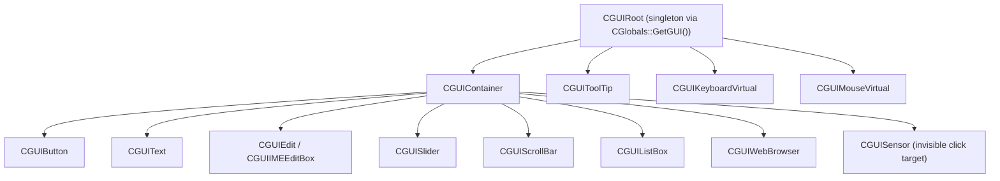

# 2D GUI Engine (2dengine/)

Location: `Client/trunk/ParaEngineClient/2dengine/` (32 headers)

The 2D engine provides screen-space GUI widgets rendered as an overlay on the 3D scene. All GUI objects derive from `CGUIBase` and are organized in a parent/child tree rooted at `CGUIRoot`.

Wiki ([NPLRuntimeAPI](https://github.com/LiXizhi/NPLRuntime/wiki/NPLRuntimeAPI)): *"GUIBase is the base class to all 2d object. GUIRoot: root node of all GUI objects."*

## Architecture



## Design Philosophy (from GUIBase.h / GUIRoot.h)

1. **Screen coordinates** — GUI uses 2D screen space, not 3D world positions
2. **No frustum culling** — visibility controlled by tags or user input, not 3D culling
3. **Annotation model** — GUI annotates the 3D scene; root scene remains dominant
4. **Two object classes:**
   - **Status objects** — render annotations (health bars, labels)
   - **GUI sensor objects** — invisible click/type targets that trigger NPL neuron files
5. **Frequent create/destroy** — GUI objects may have single-frame lifetimes (magic effect sprites)
6. **Rendered after 3D** — `PIPELINE_UI` pass, after `AdvanceScene`

## CGUIBase — Widget Base

`2dengine/GUIBase.h` — all GUI elements inherit from this.

Interfaces: `IAttributeFields`, `IObjectDrag`, `CPaintDevice` (from PaintEngine)

Key features:
- Parent/child hierarchy with screen-space layout
- `GUIPosition` — anchoring, margins, alignment
- `GUIState` — visibility, enabled, focus, triggered objects list
- `GUIEvent` — mouse, key, touch event propagation
- `EventBinding` — NPL script event bindings
- Texture and font elements for rendering (`GUITextureElement`, `GUIFontElement`)
- Attribute reflection for editor and script access

## CGUIRoot — GUI Root

`2dengine/GUIRoot.h` — singleton accessed via `CGlobals::GetGUI()`.

Responsibilities:
- Root of entire GUI tree (extends `CGUIContainer`)
- `AdvanceGUI(dTimeDelta)` — update and render all GUI each frame
- Mouse position tracking and coordinate translation
- Key stroke buffer (`KEYBUFFER_SIZE = 15`) for key sensor widgets
- IME (Input Method Editor) for CJK text input
- Touch gesture support (`TouchEventSession`, pinch zoom)
- UI scale factor for DPI/resolution independence
- Activate/inactivate on app focus change

From header comments:
> *When rendering scene, root scene and the root GUI are rendered in sequence. GUI objects make annotations to the scene. Neuron files may cause creation of GUI objects — e.g., a dialog neuron creates a dialog box annotation and button sensors.*

## Widget Types

| Class | File | Purpose |
|-------|------|---------|
| `CGUIContainer` | `GUIContainer.h` | Layout container for child widgets |
| `CGUIButton` | `GUIButton.h` | Clickable button with states (normal/hover/pressed) |
| `CGUIText` | `GUIText.h` | Static or dynamic text label |
| `CGUIEdit` | `GUIEdit.h` | Single-line text input |
| `CGUIIMEEditBox` | `GUIIMEEditBox.h` | IME-aware multi-byte text input |
| `CGUISlider` | `GUISlider.h` | Value slider control |
| `CGUIScrollBar` | `GUIScrollBar.h` | Scroll bar (horizontal/vertical) |
| `CGUIListBox` | `GUIListBox.h` | Item list with selection |
| `CGUIToolTip` | `GUIToolTip.h` | Hover tooltip popup |
| `CGUIWebBrowser` | `GUIWebBrowser.h` | Embedded HTML browser widget |
| `CGUIAttributeGrid` | `GUIAttributeGrid.h` | Property grid editor |
| `CGUIHighlight` | `GUIHighlight.h` | Selection highlight overlay |
| `CGUIScript` | `GUIScript.h` | Script-driven GUI element |
| `CGUIResource` | `GUIResource.h` | Shared GUI texture/font resources |

## Input Handling

| Class | Role |
|-------|------|
| `GUIDirectInput` | DirectInput keyboard/mouse (Windows) |
| `GUIIME` / `GUIIMEDelegate` | Input Method Editor integration |
| `GUIMouseVirtual` | Virtual mouse for touch devices |
| `GUIKeyboardVirtual` | On-screen virtual keyboard (mobile) |
| `TouchSessions` | Multi-touch session tracking |
| `TouchGestureBase` / `TouchGesturePinch` | Pinch-to-zoom gesture |
| `EventBinding` | Maps GUI events to NPL script callbacks |

Touch vs mouse mode tracked by `CParaEngineAppBase::IsTouchInputting()`.

## Rendering

GUI renders via:
- `PaintEngine/Painter` — 2D draw calls (lines, rects, text)
- `SpriteRenderer` — batched textured quads for widgets
- Shaders: `guiEffect.fx`, `guiTextEffect.fx` (embedded in OpenGL builds)

Font rendering:
- `FontRendererOpenGL` (OpenGL path)
- `SpriteFontEntity` / `SpriteFontEntityDirectX` (bitmap fonts)

## GUI + NPL Integration

GUI sensors trigger NPL activation:
1. User clicks invisible sensor widget
2. Sensor's bound neuron file is activated via `NPL.activate()`
3. Neuron reaches new state → updates or destroys GUI annotations

Key stroke sensors (added 2004.5.21):
- `CGUIRoot::AddKeyStroke()` — buffer key events
- Pick function handles mouse AND key strokes
- Triggered objects added to `GUIState::listTriggeredObjects`

Lua API: `ParaUI` namespace (`ParaScriptBindings/ParaScriptingGUI.cpp`)

## PaintEngine Integration

`CGUIBase` inherits `CPaintDevice` from `PaintEngine/`:
- `Painter.h` — Qt-like 2D drawing API
- `PaintDevice.h` — abstract paint surface
- `PainterState.h` — transform stack, clip regions

Used for custom widget rendering and 2D canvas operations (`ParaPainter` Lua API).

## File Index

```
2dengine/
├── GUIRoot.h / .cpp         GUI root singleton
├── GUIBase.h / .cpp         Widget base class
├── GUIContainer.h           Layout container
├── GUIButton.h              Button widget
├── GUIText.h                Text label
├── GUIEdit.h                Text input
├── GUIIMEEditBox.h          IME text input
├── GUIIME.h / GUIIMEDelegate.h  IME support
├── GUISlider.h              Slider
├── GUIScrollBar.h           Scroll bar
├── GUIListBox.h             List box
├── GUIToolTip.h             Tooltips
├── GUIWebBrowser.h          Embedded browser
├── GUIAttributeGrid.h       Property grid
├── GUIHighlight.h           Selection highlight
├── GUIScript.h              Script-driven widget
├── GUIResource.h            Shared resources
├── GUIPosition.h            Layout positioning
├── GUIState.h               Widget state
├── GUIEvent.h               Event types
├── EventBinding.h           Script event binding
├── GUIDirectInput.h         DirectInput
├── GUIMouseVirtual.h        Virtual mouse
├── GUIKeyboardVirtual.h     Virtual keyboard
├── TouchSessions.h          Touch tracking
├── TouchGestureBase.h       Gesture base
├── TouchGesturePinch.h      Pinch gesture
├── FontRendererOpenGL.h     GL font rendering
├── TextureParams.h          Texture parameters
└── GrowableArray.h          Dynamic array utility
```
