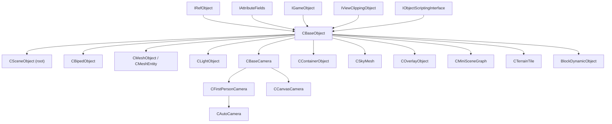

# 3D Engine (3dengine/)

Location: `Client/trunk/ParaEngineClient/3dengine/` (~102 headers, ~195 total files)

The 3D engine manages the scene graph, cameras, lighting, characters, terrain integration, weather, physics hooks, and the hard-coded render pipeline. `CSceneObject` is the central singleton.

## Class Hierarchy



## CBaseObject — Scene Node

`3dengine/BaseObject.h` — foundation for all 3D objects.

### Volume Attributes (OBJECT_ATTRIBUTE)

Objects declare spatial behavior via bit flags:

| Flag | Meaning | Example Use |
|------|---------|-------------|
| `OBJ_VOLUMN_SENSOR` | Generates collision/sensor events | Walls, chairs, gates |
| `OBJ_VOLUMN_CONTAINER` | Children exist inside its volume | Houses, rooms |
| `OBJ_VOLUMN_FREESPACE` | Solid objects can rest on surface | Floors, terrain |
| `OBJ_VOLUMN_ISOLATED` | Can overlap siblings in space | Multiple terrains, sky |
| `OBJ_VOLUMN_TILE_VISITOR` | Larger perception radius than collision | Biped AI tile visits |
| `OBJ_VOLUMN_VIP` | Triggers scene plot in view radius | Story trigger zones |
| `OBJ_VOLUMN_INVISIBLE` | Not drawn; physics may still load | Hidden collision |
| `MESH_USE_LIGHT` | Affected by scene lights | Most meshes |
| `MESH_BILLBOARDED` | Always face camera (Y axis) | Trees, icons |
| `MESH_SHADOW_RECEIVER` | Receives shadows | Terrain, floors |
| `MESH_SHADOW_NOT_CASTER` | Does not cast shadows | Small props |
| `MESH_VEGETATION` | Vegetation rendering path | Grass, trees |
| `OBJ_BIG_STATIC_OBJECT` | Attached to terrain tile | Large buildings |
| `OBJ_SKIP_RENDER` | Skip render queue; included in picking | Logic-only objects |
| `OBJ_CUSTOM_RENDERER` | Custom draw; default Draw() no-op | Special effects |

Example combinations (from header comments):
- Scene root: `ISOLATED | FREESPACE`
- Floor/terrain: `ISOLATED | FREESPACE | CONTAINER`
- Biped: `SENSOR`
- Skybox: `ISOLATED | FREESPACE`
- House: `CONTAINER | FREESPACE`

### View Culling Rules

1. Draw only when in view frustum
2. Skip container children if container is out of view
3. Inside a house container: draw interior, not house shell
4. Outside a house: draw shell, not interior children

### Physics Methods (PHYSICS_METHOD)

| Flag | Behavior |
|------|----------|
| `PHYSICS_LAZY_LOAD` | Load physics when dynamic object enters bbox; unload on GC |
| `PHYSICS_ALWAYS_LOAD` | Load on create, never unload |
| `PHYSICS_FORCE_NO_PHYSICS` | No physics (overrides all) |
| `PHYSICS_LOAD_FROM_ASSET` | Collision from untextured mesh faces |
| `PHYSICS_FORCE_DYNAMIC` | Force dynamic rigid body |

### Object Types (ObjectType enum)

Key types: `_Floor`, `_Sky`, `_Character`, `_Mesh`, `_Light`, `_Camera`, `_Container`, `_TerrainTile`, `_BlockWorld`, `SceneRoot`, and more — used for factory creation and render queue classification.

## CSceneObject — Scene Root

`3dengine/SceneObject.h` — manages the entire 3D world.

Flat root children include:
- Global terrain (`CGlobalTerrain` via `ParaTerrain`)
- Active camera (`CAutoCamera`)
- Sun light (`CSunLight`)
- Sky mesh pool (`CSkyMesh`)
- Quad-tree of 3D scene objects
- Physics world
- Block world client (`BlockWorldClient`)
- AI simulator hook
- Mini scene graph pool
- Current player biped

Key methods:

| Method | Purpose |
|--------|---------|
| `AdvanceScene(dTimeDelta, nPipelineOrder)` | Build render list + render 3D scene |
| `PrepareRender(pCamera, sceneState)` | Culling, sort, queue building |
| `RenderCharacters(sceneState, list)` | Skeletal character pass |
| `RenderShadowMap()` | Shadow map generation |
| `RenderShadows()` | Stencil shadow volumes |
| `RenderFullScreenGlowEffect()` | Post-process glow |
| `RenderHeadOnDisplay(nPass)` | Name tags, health bars above objects |
| `HandleUserInput()` | Route input to scene |
| `SetCurrentPlayer(CBipedObject*)` | Active player character |
| `EnableMouseEvent(bEnable)` | Scene mouse event generation |
| `AttachObject(CBaseObject*)` | Add object to scene |

Access: `CSceneObject::GetInstance()` (NULL if never created).

## Cameras

| Class | Inherits | Role |
|-------|----------|------|
| `CBaseCamera` | `CBaseObject` | Frustum, view/projection matrices |
| `CFirstPersonCamera` | `CBaseCamera` | FPS-style camera |
| `CAutoCamera` | `CFirstPersonCamera` | Auto-follow, orbit, collision-aware |
| `CCanvasCamera` | `CBaseCamera` | Fixed orthographic / canvas view |
| `CameraFrustum` | — | Frustum extraction and testing |

Viewport manager supports stereo (multiple viewports sharing one scene).

## Characters & Animation

| Class | Role |
|-------|------|
| `CBipedObject` | Player/NPC character with biped controller |
| `CBipedController` | Locomotion, jumping, terrain following |
| `CBipedStateManager` | Animation state machine |
| `ParaXAnimInstance` | Runtime skeletal animation playback |
| `AnimInstanceBase` | Animation instance base |
| `CustomCharModelInstance` | Customizable character (face, skin, attachments) |
| `CustomCharFace` | Facial morph targets |
| `CustomCharSettings` | Character customization config |
| `FaceTrackingCtrler` | Webcam face tracking controller |
| `DummyAnimInstance` | Placeholder animation |
| `SequenceManager` / `SequenceEntity` | Cutscene/sequence playback |
| `SequenceCtler` | Sequence controller |

ParaX assets loaded via `AssetManager<ParaXEntity>` → instanced as `ParaXAnimInstance` on scene objects.

## Lighting & Shadows

| Class | Role |
|-------|------|
| `CLightObject` | Point/spot/directional light |
| `CSunLight` | Directional sun with shadow mapping |
| `CLightManager` | (via scene) light pool management |
| `LightParam` | Light parameter struct |
| `ShadowMap` | Shadow map render target |
| `ShadowVolume` / `ShadowCaster` | Stencil shadow volumes |
| `DropShadowRenderer` | Character blob shadows (Engine/) |
| `light_scattering_data.h` | Atmospheric light scattering |

## Environment & Weather

| Class | Role |
|-------|------|
| `CEnvironmentSim` | Collision/environment simulation (`IEnvironmentSim`) |
| `WeatherEffect` | Weather state manager |
| `WeatherParticle` / `WeatherParticleSpawner` | Rain, snow particles |
| `WorldInfo` | World metadata (time, weather state) |

## Terrain Integration

| Class | Role |
|-------|------|
| `CTerrainTile` | Single terrain tile in scene graph |
| `CTerrainTileRoot` | Root terrain tile manager |
| `TerrainTileRoot` | Tile attachment to scene |

Full terrain system in `terrain/` directory — see terrain section in [components.md](../components.md).

## Block World Integration

| Class | Role |
|-------|------|
| `BlockWorldClient` | Client view of voxel block world |
| `BlockDynamicObject` | Dynamic block entity in scene |

Full block system: [block-engine.md](block-engine.md).

## Selection & Picking

| Class | Role |
|-------|------|
| `SelectionManager` | Multi-object selection state |
| `SceneObjectPicking` | Ray-scene intersection |
| `BufferPicking` | GPU color-buffer picking |
| `RayCollider` | Ray collision testing |
| `ShapeRay` | Ray shape primitive |

## Mini Scene Graph

`CMiniSceneGraph` — lightweight overlay 3D scenes with own camera and render target:
- 3D manipulation gizmos
- Particle previews
- 3D cursors
- Post-UI 3D overlays (`PIPELINE_POST_UI_3D_SCENE`)

## AI

| Class | Role |
|-------|------|
| `AIModuleNPC` | NPC AI behavior module |
| `AISimulator` | (NPL/) Frame hook for AI + script tick |

## Scene State & Render Lists

| Class | Role |
|-------|------|
| `SceneState` | Per-frame render state: camera, fog, materials, device |
| `sceneRenderList` | Sorted render queues by material/type |
| `RenderTarget` | Off-screen render targets |
| `Viewport` | Viewport manager entry |
| `EffectHelper` | Per-object effect setup |
| `EffectFileHandles` | Cached effect file handles on objects |

## Other 3D Objects

| Class | Role |
|-------|------|
| `CSkyMesh` | Sky dome/box rendering |
| `COverlayObject` | 2D-in-3D overlay quads |
| `CMissileObject` | Projectile entities |
| `CSphereObject` | Debug/test sphere |
| `CTileObject` | Tile-based placement |
| `CContainerObject` | Spatial container (house, room) |
| `CManagedLoader` | Managed asset loading object |
| `CMirrorSurface` | Reflective surfaces (client only) |
| `ParaXRefObject` | External model reference |
| `ParaXModelCanvas` | Model preview canvas |
| `AttributeProvider` | Dynamic attribute provider for objects |
| `ObjectEvent` | Per-object event dispatch |
| `PredefinedEvents` | Built-in object events |
| `SceneWriter` | Scene serialization/export |
| `ParaXSerializer` | ParaX format serialization |
| `ParaXMaterial` | Material definitions |
| `MCIController` / `Win32MCI` | Media control (legacy) |
| `MoviePlatform` / `MovieCtrlers` | In-engine movie playback |
| `AudioEngine2` | 3D positional audio (in 3dengine/) |
| `PhysicsWorld` / `ParaPhysics` | Physics world manager |

## Physics Integration

`PhysicsWorld.h` / `ParaPhysics.h` — interfaces to Bullet3 plugin (`PhysicsBT/`):
- Static mesh collision (from mesh faces or asset)
- Dynamic rigid bodies
- Character controllers
- Ray casting

Block physics handled separately by BlockEngine (not Bullet).

## Complete Header List

```
3dengine/
├── SceneObject.h          Scene root singleton
├── BaseObject.h           All scene nodes
├── IGameObject.h          Game object interface
├── IScene.h               Scene interface
├── IRefObject.h             Reference counting
├── IViewClippingObject.h    Frustum culling
├── SceneState.h             Per-frame state
├── sceneRenderList.h        Render queues
├── BaseCamera.h / AutoCamera.h / CanvasCamera.h
├── CameraFrustum.h
├── BipedObject.h / BipedController.h / BipedStateManager.h
├── ParaXAnimInstance.h / AnimInstanceBase.h
├── CustomCharModelInstance.h / CustomCharFace.h / CustomCharSettings.h
├── LightObject.h / SunLight.h / LightParam.h
├── ShadowMap.h / ShadowVolume.h
├── SkyMesh.h / OverlayObject.h
├── MiniSceneGraph.h
├── EnvironmentSim.h
├── WeatherEffect.h / WeatherParticle.h
├── PhysicsWorld.h / ParaPhysics.h
├── TerrainTile.h / TerrainTileRoot.h
├── BlockDynamicObject.h (BlockWorldClient in BlockEngine/)
├── SelectionManager.h / SceneObjectPicking.h / BufferPicking.h
├── Viewport.h / RenderTarget.h
├── SequenceManager.h / SequenceEntity.h
├── AIModuleNPC.h
├── AudioEngine2.h
├── ParaEngineSettings.h
└── ... (102 headers total)
```
