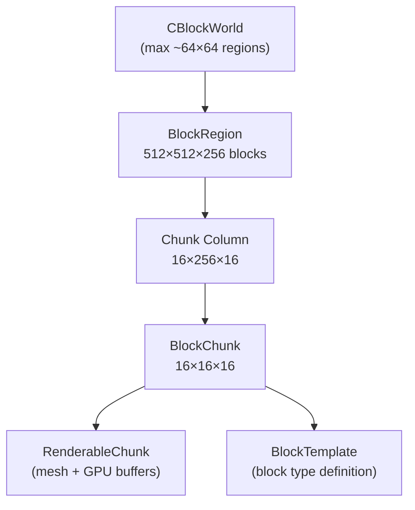

# Block Engine

Location: `Client/trunk/ParaEngineClient/BlockEngine/` (62 files)

The Block Engine implements a Minecraft/Paracraft-style voxel block world with region-based persistence, chunk meshing, light propagation, and separate physics from Bullet.

Wiki ([NPLRuntimeAPI](https://github.com/LiXizhi/NPLRuntime/wiki/NPLRuntimeAPI)):
> *BlockEngine manages rendering of 32000×32000×256 blocks.*
> - BlockRegion: 512×512×256 blocks, saved to a single file
> - ChunkColumn: 16×16×256
> - Chunk: 16×16×16, static renderable object

## World Hierarchy



## Dimensions (from BlockConfig.cpp)

| Constant | Value | Notes |
|----------|-------|-------|
| `g_regionBlockDimX` | 512 | Blocks per region (X) |
| `g_regionBlockDimY` | 256 | Blocks per region (Y/height) |
| `g_regionBlockDimZ` | 512 | Blocks per region (Z) |
| `g_chunkBlockDim` | 16 | Blocks per chunk edge |
| `g_regionChunkDimX/Z` | 32 | Chunks per region (512/16) |
| `g_regionChunkDimY` | 16 | Vertical chunks (256/16) |
| `g_regionSize` | 533.3333 | World units per region |
| `g_blockSize` | ~1.0417 | World units per block |
| `g_maxFaceCountPerBatch` | 9000 | GPU batch limit (≤10920) |

### World Scale

Default world bounds (`BlockWorld.cpp` constructor):
- Regions: 0..63 in X and Z → **64 × 64 regions**
- World blocks: up to **64×512 = 32,768** in X/Z (≈ wiki's 32000)
- Height: **256 blocks** (Y: 0..255)

Each region saved as a single file on disk.

## Core Classes

### CBlockWorld

`BlockEngine/BlockWorld.h` — base class for block world instances.

Implements `IAttributeFields` and `IObjectScriptingInterface` (scriptable from NPL).

Key capabilities:
- Block get/set by world coordinates
- Region loading/unloading
- Render distance control
- Light grid management
- World locking (thread-safe block access)
- Dirty tracking for mesh rebuilds
- Chunk column timestamps

Script attributes exposed: `GetRenderDist`, `SetRenderDist`, `LockWorld`, `UnlockWorld`, `ResetAllLight`, `ClearBlockRenderCache`, etc.

### BlockWorldClient

`BlockEngine/BlockWorldClient.h/.cpp` — client-side view integrated with `CSceneObject`.

Additional client features:
- Multi-frame renderer (`MultiFrameBlockWorldRenderer`)
- Integration with terrain height for block placement
- Block selection highlighting (`CBlockSelectGroup`)
- Async region loading

### BlockRegion

`BlockEngine/BlockRegion.h` — 512×512×256 block storage unit.

- Identified by `(regionX, regionZ)` integer coordinates
- Persists to/from file (`LoadFromFile`, `SaveToFile`)
- Lock during async I/O (`IsLocked`, `SetLocked`)
- Height map per column (`ChunkMaxHeight`)
- Biome data (partially implemented)
- Light refresh per chunk column

Coordinate ranges within region:
- X, Z: `[0, 512)`
- Y: `[0, 256)`

### BlockChunk

`BlockEngine/BlockChunk.h/.cpp` — 16×16×16 voxel storage.

- Contains block template IDs + user data per cell
- Dirty flag for mesh regeneration
- Neighbor chunk awareness for face culling

### RenderableChunk

`BlockEngine/RenderableChunk.h/.cpp` — GPU-ready mesh for a chunk.

- Vertex/index buffers built by tessellators
- Multiple render passes (opaque, alpha-test, alpha-blend, water)
- Bounding box for frustum culling

## Block Types

### BlockTemplate

`BlockEngine/BlockTemplate.h/.cpp` — defines a block type:
- Block ID, name, texture indices
- Solid/transparent/liquid flags
- Light emission value
- Custom model provider reference

### BlockModel Providers

Specialized geometry generators:

| Provider | File | Geometry |
|----------|------|----------|
| `BlockModelProvider` | `BlockModelProvider.h` | Standard cube faces |
| `StairModelProvider` | `StairModelProvider.h` | Stair blocks |
| `SlopeModelProvider` | `SlopeModelProvider.h` | Sloped blocks |
| `WireModelProvider` | `WireModelProvider.h` | Wire/cable blocks |
| `CarpetModelProvider` | `CarpetModelProvider.h` | Thin carpet blocks |

Managed by `BlockModelManager` — maps template IDs to providers.

## Rendering

### Render Passes (BlockRenderPass)

| Pass | Order | Contents |
|------|-------|----------|
| `BlockRenderPass_Opaque` | 1 | Solid blocks |
| `BlockRenderPass_AlphaTest` | 2 | Cutout textures (leaves, fences) |
| `BlockRenderPass_AlphaBlended` | 3 | Transparent blocks (glass, water) |
| `BlockRenderPass_ReflectedWater` | 4 | Water reflections (deferred) |

### Mesh Building Pipeline

```
Block change → dirty chunk flag
    → BlockRenderTask (queued)
    → BlockTessellators (face generation with neighbor culling)
    → ChunkVertexBuilderManager (vertex compression)
    → RenderableChunk (GPU upload)
    → MultiFrameBlockWorldRenderer (spread across frames)
```

`BlockTessellators.h/.cpp` — generates quad faces, handles ambient occlusion.

`ChunkVertexBuilderManager` — compresses vertex data for batch rendering.

### Light System

| Class | Role |
|-------|------|
| `BlockLightGridBase` | Base light propagation grid |
| `BlockLightGridClient` | Client-side light updates |
| `BlockLightGridServer` | Server-side light (headless) |

Light values:
- `g_maxValidLightValue = 127`
- `g_sunLightValue = 0xf` (sky light)
- `g_maxLightValue = 0xf` (block light)

Sun light propagates top-down; block light spreads from luminous blocks. Light updates can be suspended (`SuspendLightUpdate`) for bulk edits.

## Physics

Block physics is handled **internally by BlockEngine**, not Bullet:
- Block solidity checks for entity movement
- Separate from `PhysicsWorld` / Bullet integration
- Wiki: *"Block physics is handled separately by the BlockEngine itself"*

## Persistence

| Component | Role |
|-----------|------|
| `BlockDataCodec` | Binary encode/decode block data |
| `BlockRegion::SaveToFile` | Region → disk file |
| `BlockRegion::LoadFromFile` | Disk → region (async with lock) |
| `BlockWorldManager` | Multi-world management |

Region files contain all chunks for a 512×512 area.

## Threading

| Class | Role |
|-------|------|
| `BlockReadWriteLock` | RW lock for concurrent block access |
| `BlockRenderTask` | Background mesh build tasks |

`LockWorld()` / `UnlockWorld()` on `CBlockWorld` for bulk operations.

## Coordinate Systems

| Class | Role |
|-------|------|
| `BlockCoordinate` | World ↔ region ↔ chunk ↔ block coordinate conversion |
| `BlockIndex` | Linear block index within chunk |
| `BlockDirection` / `BlockFacing` | Block face orientation |
| `RelativeBlockPos` | 26 neighbor positions (+ center) |

Coordinate suffixes in code:
- `_ws` — world space
- `_rs` — region space
- `_cs` — chunk space

## Script API

Lua namespace: `ParaBlockWorld` (`ParaScriptBindings/ParaScriptingBlockWorld.cpp/.h`)

Key script functions:
- Block placement/removal by coordinates
- Region load/unload
- Block template queries
- Selection groups for highlighting

Also exposed as attributes on `CBlockWorld` via `IAttributeFields` — editable in property grid and from NPL.

## Integration with Scene

`BlockWorldClient` attaches to `CSceneObject` as a scene child. Block rendering occurs inside `CSceneObject::AdvanceScene` during the block render passes, using the same camera and fog as the 3D scene.

Block world can sync terrain height from `CGlobalTerrain` for natural world generation.

## File Index

```
BlockEngine/
├── BlockWorld.h / .cpp           World base class
├── BlockWorldClient.h / .cpp     Client integration
├── BlockWorldManager.h / .cpp    Multi-world manager
├── BlockRegion.h / .cpp          512³ region storage
├── BlockChunk.h / .cpp           16³ chunk storage
├── RenderableChunk.h / .cpp      GPU mesh
├── BlockTemplate.h / .cpp        Block type definition
├── BlockModel.h / .cpp           Block model instance
├── BlockModelProvider.h / .cpp   Cube face generator
├── StairModelProvider.*          Stair geometry
├── SlopeModelProvider.*          Slope geometry
├── WireModelProvider.*           Wire geometry
├── CarpetModelProvider.*         Carpet geometry
├── BlockModelManager.*           Provider registry
├── BlockTessellators.*           Face tessellation
├── ChunkVertexBuilderManager.*   Vertex builder
├── BlockRenderTask.*             Async mesh tasks
├── MultiFrameBlockWorldRenderer.* Spread render across frames
├── BlockLightGridBase/Client/Server.*  Light propagation
├── BlockConfig.h / .cpp          Dimension constants
├── BlockCommon.h / .cpp          Shared types, select groups
├── BlockCoordinate.*             Coordinate math
├── BlockDataCodec.*              Binary persistence
├── BlockMaterial.*               Block material properties
├── BlockMaterialManager.*        Material registry
└── BlockReadWriteLock.*          Thread synchronization
```
