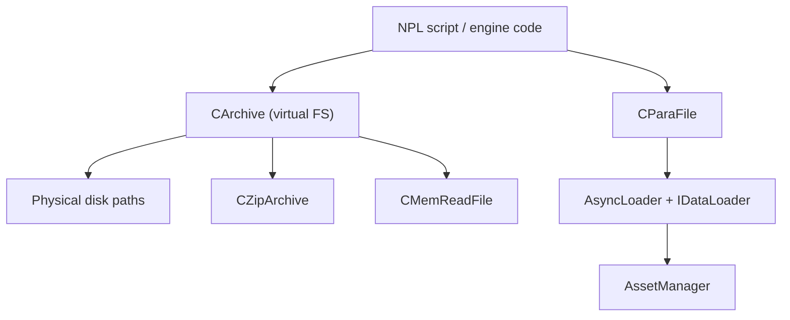

# IO & Filesystem

Location: `Client/trunk/ParaEngineClient/IO/` (~20+ files)

The IO module provides virtual filesystem access, zip archives, async resource loading, and platform I/O (serial port, Bluetooth, file watching).

Wiki ([NPLRuntimeAPI](https://github.com/LiXizhi/NPLRuntime/wiki/NPLRuntimeAPI)):
> *FileManager manages all files and search paths. CParaFile manages single file read/write.*

## Architecture



## Core File Classes

### CParaFile

`IO/ParaFile.h` — primary file I/O class (~500+ lines).

Capabilities:
- Binary read/write with templated stream operators
- Seek, tell, EOF detection
- Path normalization (strip drive letters on Windows for portability)
- Integration with virtual archive system
- Lua binding via `ParaIO` namespace

Used throughout engine for config files, block region persistence, scene serialization.

### CArchive — Virtual File Manager

`IO/Archive.h` — unified file access layer.

- Maintains search paths (multiple roots)
- Transparent access to files in zip packages or on disk
- `FindFile()` — search across all registered paths
- `ArchiveFileFindItem` — find results with path metadata
- Implements `IAttributeFields` for script access

This is the engine's "FileManager" from the wiki — all asset paths resolve through archive search paths.

### Zip Support

| Class | Role |
|-------|------|
| `CZipArchive` | Read zip files; extends `CArchive` |
| `CZipWriter` | Create/write zip archives |
| `ZipArchiveEntry` | Single entry metadata |

Zip structures (PKZIP format):
- `ZIP_EndOfCentralDirectory`, `ZIP_CentralDirectory`, `SZIPFileHeader`
- `SZipFileEntry` — cached entry with data pointer

Used for packaging game assets into single `.zip` packages for distribution.

### Read Variants

| Class | Role |
|-------|------|
| `CReadFile` | Standard disk file read via `IReadFile` interface |
| `CMemReadFile` | Read from in-memory buffer |
| `FileData` | Raw file data holder |
| `FileHandle` | OS file handle wrapper |

### Embedded Resources

`IO/ResourceEmbedded.h` — compile-time embedded files:
- Shaders (`.fxo`, `.fx.glsl`)
- Icons (`paraworld.ico`, `haqi.ico`)
- Templates (`ParaXmodel.templates`)
- Cursor (`cursor.tga`)

Generated by `NPLRuntime/embed-resource/` CMake macros (`embed_resources_abs`).

## Async Loading

`IO/IDataLoader.h` — async I/O framework:

```cpp
struct ResourceRequest {
    std::string key;          // asset path
    IDataLoader* loader;      // background reader
    IDataProcessor* processor; // data converter
    void* userData;
};

class CResourceRequestQueue : public concurrent_ptr_queue<ResourceRequest_ptr>;
```

Flow:
1. `AssetManager::LoadAsync(key)` enqueues `ResourceRequest`
2. Background thread: `IDataLoader::LoadData()` reads bytes
3. Main/worker thread: `IDataProcessor::ProcessData()` creates entity
4. Render thread: `RenderFrameMove()` finalizes and notifies

## File Utilities

| Class | File | Role |
|-------|------|------|
| `FileUtils` | `FileUtils.cpp` | Path manipulation, copy, delete |
| `FileSystemWatcher` | `FileSystemWatcher.h/.cpp` | Monitor file changes for hot reload |

Directory monitoring also via standalone `dirmonitor/` module (inotify/kqueue/fsevents/Windows backends).

## Platform I/O

| Class | Role |
|-------|------|
| `SerialPort` / `Serial` | Async serial port with read callback |
| `BlueTooth` | Bluetooth device communication |
| `UrlLoaders` (Core/) | HTTP URL fetching for remote assets |

## Search Path System

At startup, `CParaEngineAppBase::FindParaEngineDirectory()` locates the engine root and sets working directory. Archive search paths typically include:

```
./                          (working directory)
./script/                   (NPL scripts)
./assets/ or ./packages/    (game assets)
./config/                   (configuration)
```

Zip packages can be mounted as additional search paths, allowing modular content delivery via `npl_packages/`.

## NPL Package Config

`Core/NPLPackageConfig.h` — configuration for NPL script packages:
- Package manifest paths
- Dependency resolution between script packages

## Lua API

| Namespace | Key Functions |
|-----------|---------------|
| `ParaIO` | File read/write, path operations, archive access |
| `ParaAsset` | Asset loading (delegates to AssetManager) |
| `ParaBootStrapper` | Bootstrapper file load/save |

Bindings: `ParaScriptBindings/ParaScriptingIO.cpp`, `ParaScripting5.cpp`

## curl Integration

`curllua/` — libcurl bindings for Lua HTTP requests:
- Used by `ParaNetwork` namespace
- Complements `UrlLoaders` for C++ HTTP fetching

## File Index

```
IO/
├── ParaFile.h / .cpp         Primary file I/O
├── Archive.h / .cpp          Virtual filesystem
├── ZipArchive.h              Zip reading
├── ZipWriter.h / .cpp        Zip writing
├── ReadFile.h                Disk file reader
├── MemReadFile.h             Memory file reader
├── FileData.h                Raw data holder
├── FileHandle.h              OS handle wrapper
├── IDataLoader.h             Async loader interface
├── FileUtils.cpp             Path utilities
├── FileSystemWatcher.h/.cpp  Change notification
├── SerialPort.h / .cpp       Serial I/O
├── BlueTooth.h / .cpp        Bluetooth
└── ResourceEmbedded.h        Embedded resource access

dirmonitor/                   Cross-platform dir watching
├── dir_monitor.hpp
├── basic_dir_monitor.hpp
├── inotify/   (Linux)
├── kqueue/    (macOS/BSD)
├── fsevents/  (macOS)
└── windows/   (Windows)
```

## Conventions

- Windows paths: drive letters stripped for portability (`C:\game\assets` → `\game\assets`)
- `(gl)` prefix in NPL resolves through archive search paths
- Block region files, bootstrapper XML, config files all use `CParaFile` or `CArchive`
- Async load is default; synchronous load available for small/critical assets
