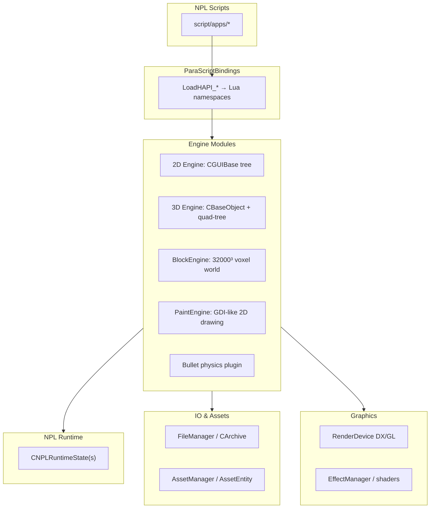

# ParaEngineClient Overview

ParaEngineClient is a full-featured C/C++ game engine embedded in NPLRuntime. It was originally a standalone computer game engine; it now ships as the rendering and simulation core of the NPL runtime. All C++ APIs are exposed to NPL/Lua scripts via luabind bindings in `ParaScriptBindings/`.

## Role in the Monorepo

```
Client/trunk/ParaEngineClient/     ← all engine C++ source
    ├── compiled by Client/CMakeLists.txt       → ParaEngineClient (npl)
    └── compiled by NPLRuntime/ParaEngineServer → ParaEngineServer (npls, subset)
```

The server build shares Core, NPL, 3dengine, renderer, ParaScriptBindings, terrain, BlockEngine, IO, and most utility code. It excludes full Engine/, GUI browser, shader fxc pipeline, and most game-specific providers.

## Architectural Layers (Wiki: NPLRuntimeAPI)

From the [NPLRuntimeAPI wiki](https://github.com/LiXizhi/NPLRuntime/wiki/NPLRuntimeAPI), modules stack as:



### Design Principles (from wiki + source)

1. **Main-thread rendering:** All GUI and 3D objects must be created on the main NPL thread (same as renderer thread).
2. **Dual hierarchy for 3D:** Objects live in both a parent/child tree and a spatial quad-tree for culling.
3. **Dual hierarchy for 2D:** GUI objects form a parent/child tree in screen coordinates.
4. **Async asset loading:** Assets load in background threads; rendering thread receives callbacks.
5. **Activation-driven logic:** Game logic runs in NPL neuron files, not C++ update loops.
6. **Hard-coded render pipeline:** The 3D pipeline in `CSceneObject::AdvanceScene` uses predefined shaders per object type. Custom shaders are possible via NPL script overrides but require multi-platform variants.

## Main Loop

### Frame Move (simulation / logic)

`CParaEngineApp::FrameMove()` in `Engine/ParaEngineApp.cpp`:

```
FrameMove(fTime)
├── FRC_GAME:   game time delta (pausable)
├── FRC_SIM:    environment simulation delta
│   └── CAISimulator::FrameMove()  ← NPL script + network tick
├── FRC_IO:     async I/O processing
└── OnFrameEnded()
```

Multiple frame rate controllers (`FRC_GAME`, `FRC_SIM`, `FRC_IO`, `FRC_RENDER`) allow independent timing for game logic, AI/network, I/O, and rendering.

### Render (visual output)

`CParaEngineApp::Render()`:

```
Render()
├── BeginScene()
├── Clear backbuffer + depth/stencil
├── ViewportManager::Render(fElapsed, PIPELINE_3D_SCENE)
│   └── CSceneObject::AdvanceScene()  ← full 3D pipeline
├── ViewportManager::Render(fElapsed, PIPELINE_UI)
│   └── CGUIRoot::AdvanceGUI()          ← 2D GUI overlay
├── ViewportManager::Render(fElapsed, PIPELINE_POST_UI_3D_SCENE)
│   └── Mini scene graphs, post-UI 3D
└── EndScene() → Present
```

See [rendering-pipeline.md](rendering-pipeline.md) for the full 3D sub-pipeline inside `AdvanceScene`.

## Key Singletons

| Accessor | Class | Role |
|----------|-------|------|
| `CParaEngineAppBase::GetInstance()` | `CParaEngineApp` | Application, device, window |
| `CSceneObject::GetInstance()` | `CSceneObject` | 3D scene root |
| `CGlobals::GetGUI()` | `CGUIRoot` | 2D GUI root |
| `CGlobals::GetNPLRuntime()` | `CNPLRuntime` | NPL scripting + networking |
| `CGlobals::GetAssetManager()` | Asset managers | Textures, models, effects |
| `CGlobals::GetEffectManager()` | `CEffectManager` | Shader/effect state |
| `CGlobals::GetRenderDevice()` | `RenderDevice` | Graphics device |
| `CBootStrapper::GetSingleton()` | `CBootStrapper` | Main loop script path |

Defined in `Core/Globals.h` / `Globals.cpp`.

## Application Bootstrap

Boot order (from `doc/ParaEngineBootStrapping`):

1. Parse command-line name/value pairs (`bootstrapper=...`, resolution, etc.)
2. `CParaEngineApp::Init()` — config, graphics, NPL runtime, script bindings
3. `CBootStrapper::LoadFromFile()` — read XML bootstrapper
4. Activate main loop script every ~0.5 seconds

Bootstrapper XML example:

```xml
<?xml version="1.0" ?>
<MainGameLoop>(gl)script/apps/Taurus/main_loop.lua</MainGameLoop>
<ConfigFile>config/config.safemode.txt</ConfigFile>
```

Launch:

```
ParaEngineClient.exe bootstrapper="script/apps/Taurus/bootstrapper.xml"
```

Default main loop: `(gl)script/gameinterface.lua`

## Embedding Modes

From [EmbeddingNPLRuntime wiki](https://github.com/LiXizhi/NPLRuntime/wiki/EmbeddingNPLRuntime):

| Mode | CMake Option | Use Case |
|------|-------------|----------|
| Standalone EXE | default | `npl` launcher |
| DLL plugin | `PARAENGINE_CLIENT_DLL` | Host app loads `ParaEngineClient.dll` at runtime via plugin interface — **headers only, no link lib required** |
| Static library | `NPLRUNTIME_STATIC_LIB=ON` | Single executable with embedded engine |

When embedding as DLL, copy `ParaEngineClient.dll` and dependencies from ParacraftSDK `./redist` folder. Debug with working directory set to the app's script folder.

## Client vs Server Compilation

| Module | Client (DX) | Client (GL) | Server |
|--------|-------------|-------------|--------|
| Core | ✓ | ✓ | ✓ |
| NPL | ✓ | ✓ | ✓ |
| 3dengine | ✓ | ✓ | ✓ |
| 2dengine | ✓ | ✓ | ✓ |
| renderer | ✓ DX | ✓ GL | ✓ (GL or stub) |
| ParaScriptBindings | ✓ | ✓ | ✓ |
| terrain, BlockEngine | ✓ | ✓ | ✓ |
| Engine/ (full) | ✓ | partial | server entry only |
| VoxelMesh, CadModel | ✓ DX | — | — |
| Shader fxc / embed | ✓ | dx2gl | embed-resource |
| WebBrowser | ✓ | — | — |

## Directory Size Reference

| Directory | ~Files | Primary Purpose |
|-----------|--------|-----------------|
| `3dengine/` | 195 | Scene graph, cameras, characters, weather |
| `Engine/` | 194 | Client entry, DB providers, post-effects (many obsoleted) |
| `ParaScriptBindings/` | 52 | Lua API |
| `NPL/` | 65 | Scripting runtime |
| `BlockEngine/` | 62 | Voxel block world |
| `terrain/` | 56 | Heightmap terrain |
| `Core/` | 88 headers + cpp | Engine kernel |
| `2dengine/` | 32 | GUI widgets |
| `ParaXModel/` | 32+ | Model format and loaders |
| `renderer/` | 30 | Graphics backends |
| `IO/` | 20+ | File I/O |
| `PaintEngine/` | 15+ | 2D raster |
| `util/` | 20+ | Threading, logging, pools |

## Related Documents

- [Core subsystem](core.md) — attributes, assets, plugins, events
- [3D engine](3dengine.md) — scene objects, volume attributes, culling
- [Rendering pipeline](rendering-pipeline.md) — AdvanceScene stages
- [Block engine](block-engine.md) — voxel world dimensions and hierarchy
