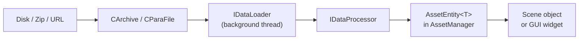

# ParaX Model & Asset Pipeline

Locations:
- `Client/trunk/ParaEngineClient/ParaXModel/` — model format and loaders
- `Client/trunk/ParaEngineClient/Core/` — asset managers and content loaders
- `Client/trunk/ParaEngineClient/BMaxModel/` — Blender export format

Wiki ([NPLRuntimeAPI](https://github.com/LiXizhi/NPLRuntime/wiki/NPLRuntimeAPI)):
> *AssetEntity is the base class to all assets. Assets load asynchronously from disk or network.*
> - TextureEntity, MeshEntity, ParaXEntity, EffectFile, Audio, bmax model, database, font

## Asset Architecture



## AssetEntity Pattern

`Core/AssetEntity.h` — reference-counted asset base:

```cpp
AssetEntity<ParaXEntity>* model = AssetManager<ParaXEntity>::GetInstance().Load("models/hero.x");
model->addref();
// ... use model
model->Release();  // decrement; unloads when ref hits 0
```

All assets:
- Load asynchronously by default
- Cached in `AssetManager<T>` singleton by key/name
- Support case-insensitive name lookup
- Expose `IAttributeFields` for editor/script introspection
- Warn on non-zero ref count during manager cleanup (debug)

## Asset Types

| Asset Type | Entity Class | Manager | Loader |
|------------|-------------|---------|--------|
| ParaX model | `ParaXEntity` | `AssetManager<ParaXEntity>` | `ContentLoaderParaX` |
| Static mesh | `MeshEntity` | `AssetManager<MeshEntity>` | `ContentLoaderMesh` |
| Texture | `TextureEntity` | `AssetManager<TextureEntity>` | `ContentLoaderTexture` |
| Effect/shader | `EffectFile` entity | via EffectManager | sync load |
| Font | `SpriteFontEntity` | AssetManager | sync load |
| Image | `ImageEntity` | AssetManager | sync load |
| Database | `DatabaseEntity` | AssetManager | sync load |
| CCS skin | — | — | `ContentLoaderCCSSkin` |
| CCS face | — | — | `ContentLoaderCCSFace` |

Backend-specific variants: `TextureEntityDirectX` / `TextureEntityOpenGL`, `SpriteFontEntityDirectX` / `SpriteFontEntityOpenGL`.

## ParaX Format

ParaX is ParaEngine's native 3D format (`.x` extension, not to be confused with DirectX `.x`):

| Class | Role |
|-------|------|
| `CParaXModel` | In-memory model: meshes, skeleton, animations, materials |
| `ParaXEntity` | Asset wrapper loaded into AssetManager |
| `ParaXModelInstance` | Runtime instance with animation state |
| `ParaXStaticModel` | Non-animated static ParaX |
| `ParaXBone` | Skeleton bone definition |
| `BoneChain` | Bone hierarchy chain |
| `BoneAnimProvider` | Animation data provider |
| `AnimTable` | Animation name → index table |
| `ModelRenderPass` | Per-pass render configuration |
| `ParaXStaticModelRenderPass` | Static model render pass |
| `ParaXMaterial` | Material within ParaX (in 3dengine/) |
| `ParaXModelCommon.h` | Shared types and constants |
| `modelheaders.h` / `MeshHeader.h` | Binary format headers |

### Particle Systems in ParaX

`ParaXModel/particle.h`:
- `ParticleSystem` — MDX-style particle emitter
- `ParticleEmitter`, `PlaneParticleEmitter`, `SphereParticleEmitter`
- `RibbonEmitter` — trail/ribbon effects
- `ParticleSystemRef` — reference from model to particle system

### ParaX Serialization

| Class | Role |
|-------|------|
| `ParaXModelExporter` | Export to ParaX binary |
| `XFileExporter` | Export to legacy X format |
| `ParaXSerializer` (3dengine/) | Scene-level serialization |

Template file embedded at build: `res/ParaXmodel.templates`

## Import Pipelines

| Format | Loader | Dependency |
|--------|--------|------------|
| ParaX binary (`.x`) | `XFileParser` / `XFileStaticModelParser` | Native |
| Character X | `XFileCharModelParser` | Native |
| FBX | `FBXParser` / `ColladaModelLoader` | Assimp (`NPLRUNTIME_SUPPORT_FBX`) |
| glTF | `GltfModel` | Assimp or native parser |
| PLY | `PLYParser` | Native |
| BMax (Blender) | `BMaxModel/` | Native parser |
| Collada | `ColladaModelLoader` | Assimp |

Export:
- `glTFModelExporter` — export to glTF
- `XFileCharModelExporter` — export character to X

FBX support files:
```
ParaXModel/FBXParser.h/.cpp
ParaXModel/FBXModelInfo.h
ParaXModel/FBXMaterial.h
ParaXModel/ColladaModelLoader.h
ParaXModel/GltfModel.h/.cpp
```

## Runtime Animation

Once loaded, models become scene objects:

```
ParaXEntity (asset)
    → ParaXAnimInstance (on CBaseObject)
        → Bone transforms updated each frame
        → Skinning on GPU
        → Attachment points for weapons/equipment
```

Character-specific:
- `CustomCharModelInstance` — modular character with swappable parts
- `CustomCharFace` — facial morph targets
- `FaceTrackingCtrler` — webcam-driven face animation
- `SequenceManager` — cutscene animation sequences

## Async Loading Detail

`IO/IDataLoader.h`:

```cpp
class IDataLoader {
    // Called on background thread to read raw bytes
    virtual bool LoadData(ResourceRequest* request) = 0;
};

class IDataProcessor {
    // Called to convert raw bytes → asset entity on main or worker thread
    virtual bool ProcessData(ResourceRequest* request) = 0;
};
```

Queue: `CResourceRequestQueue` — thread-safe concurrent queue (`NPL::concurrent_ptr_queue`).

Frame move callback:
```cpp
CGlobals::GetAssetManager()->RenderFrameMove(fElapsedTime);
```
Processes completed loads and updates animated assets on render thread.

## BMaxModel

`BMaxModel/` — parser for Blender Max export format (Paracraft's Blender plugin output):
- Geometry, UVs, materials, armature
- Alternative pipeline to FBX for Paracraft content creation

## Voxel Models

`ParaXModel/ParaVoxelModel.h` — voxel-based model representation integrated with ParaX pipeline.

## Lua API

| Namespace | Functions |
|-----------|-----------|
| `ParaAsset` | `LoadParaX()`, texture load, effect load |
| `ParaScene` | Create mesh/character objects from assets |
| Character bindings | Bone controllers, animation playback, attachments |

Loaders in `ParaScriptBindings/ParaScripting3.cpp` (`LoadHAPI_ResourceManager`).

## File Index

```
ParaXModel/
├── ParaXModel.h / .cpp           Model data structure
├── ParaXModelInstance.h          Runtime instance
├── ParaXStaticModel.h            Static variant
├── ParaXBone.h                   Bone definition
├── BoneChain.h / BoneAnimProvider.h
├── AnimTable.h                   Animation table
├── particle.h                    Particle/ribbon systems
├── ParticleSystemRef.h
├── ModelRenderPass.h             Render pass config
├── XFileParser.h                 Native X parser
├── XFileStaticModelParser.h
├── XFileCharModelParser.h
├── XFileHelper.h / XFileDataObject.h
├── FBXParser.h / FBXModelInfo.h / FBXMaterial.h
├── ColladaModelLoader.h
├── GltfModel.h / .cpp
├── PLYParser.h
├── ParaXModelExporter.h
├── XFileExporter.h / XFileCharModelExporter.h
├── glTFModelExporter.h
├── ParaVoxelModel.h
└── modelheaders.h / MeshHeader.h / animated.h

Core/ (asset infrastructure)
├── AssetEntity.h
├── AssetManager.h
├── ContentLoaders.h
├── ContentLoaderParaX.h
├── ContentLoaderTexture.h
├── ContentLoaderMesh.h
├── TextureEntity.h (+ DirectX/OpenGL)
└── SpriteFontEntity.h (+ DirectX/OpenGL)
```
