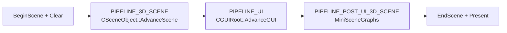

# Rendering Pipeline

This document describes the per-frame rendering flow in ParaEngineClient, based on `Engine/ParaEngineApp.cpp`, `3dengine/SceneObject.cpp`, and the [3D Overview wiki](https://github.com/LiXizhi/NPLRuntime/wiki/3DOverview).

## Top-Level Frame Render

`CParaEngineApp::Render()` orchestrates three pipeline passes:

```cpp
// Engine/ParaEngineApp.cpp
m_pViewportManager->Render(fElapsedTime, PIPELINE_3D_SCENE);
m_pViewportManager->Render(fElapsedTime, PIPELINE_UI);
m_pViewportManager->Render(fElapsedTime, PIPELINE_POST_UI_3D_SCENE);
```



All viewports share the same `CSceneObject` and `CGUIRoot`. The viewport manager supports stereo displays (multiple viewports, one scene).

## Pipeline Order Constants

Objects and subsystems declare which pipeline pass they render in:

| Constant | Order | Contents |
|----------|-------|----------|
| `PIPELINE_3D_SCENE` | First | Main 3D world rendering |
| `PIPELINE_UI` | Second | 2D GUI overlay |
| `PIPELINE_POST_UI_3D_SCENE` | Third | 3D overlays after UI (mini scene graphs) |
| `PIPELINE_COLOR_PICKING` | Special | GPU picking buffer (not visible) |

Objects can set custom order via `CBaseObject::GetRenderPipelineOrder()`.

## CSceneObject::AdvanceScene — 3D Sub-Pipeline

`AdvanceScene(double dTimeDelta, int nPipelineOrder)` in `SceneObject.cpp` is the hard-coded 3D render pipeline.

Wiki note: *"The main 3D rendering pipeline is hard-coded in CSceneObject::AdvanceScene. We use predefined shaders (materials) for a given type of objects. Developers can overwrite shaders via NPL scripts but must provide multi-platform variants."*

### Phase 0: Pre-conditions

- Respect game pause (`FRC_GAME::IsPaused()` → dTimeDelta = 0)
- Set render pipeline order on `SceneState`
- Clear extra render targets (DirectX MRT slots 1-3)

### Phase 1: Mini Scene Graphs (pre-UI)

Update and draw mini scene graphs with `GetRenderPipelineOrder() < PIPELINE_UI`:
- Own camera and render target
- 3D gizmos, particle previews

### Phase 2: Scene Disabled Fallback

If `!m_bGameEnabled || GetCurrentPlayer() == NULL`:
- Render head-on displays only
- Render owner-draw objects
- Return early

### Phase 3: Main 3D Pipeline

When scene is active with a current player:

```
PrepareRender(pCamera, sceneState)
├── Frustum culling → build sceneRenderList
├── Sort by material/render group
└── Classify: opaque, transparent, characters, terrain, blocks

UpdateFogColor()
Set global fog, material, fill mode (wireframe option)

Render passes (approximate order):
├── Sky (CSkyMesh)
├── Sun shadow map generation (RenderShadowMap)
├── Terrain tiles (CGlobalTerrain / CTerrainTile)
├── Block world opaque pass (BlockRenderPass_Opaque)
├── Opaque scene objects (front-to-back)
├── Block world alpha-test pass
├── Character rendering (RenderCharacters)
│   └── Skeletal skinning, attachments, facial animation
├── Transparent objects (back-to-front)
├── Block world alpha-blended pass
├── Shadow volumes (RenderShadows) — stencil shadows
├── Block reflected water pass
├── Head-on display pass 0 (RenderHeadOnDisplay)
├── Post-effects:
│   ├── RenderFullScreenGlowEffect()
│   ├── RenderScreenWaveEffect()
│   └── Mirror surfaces (CMirrorSurface)
└── Selection / debug overlays (RenderSelection)
```

### Phase 4: Post-UI Mini Scene Graphs

When `nPipelineOrder == PIPELINE_POST_UI_3D_SCENE`:
- Draw mini scene graphs with `PIPELINE_POST_UI_3D_SCENE` order
- Clear Z-buffer before drawing (overlay on top of UI)

## Shader / Material System

### Predefined Shaders (DirectX `.fx`)

Compiled at build time via `fxc` → `.fxo` → embedded in binary:

Location: `shaders/*.fx`

CMake builds each `.fx` with:
```
fxc /Tfx_2_0 /Gfp /Fo shader.fxo shader.fx
```

Common effect files (from embed-resource list):
- Terrain: terrain effects
- Skydome: `skydome.fx`
- Mesh: `simple_mesh_normal.fx`
- GUI: `guiEffect.fx`, `guiTextEffect.fx`
- Utility: `singleColorEffect.fx`

### OpenGL Shaders (`.fx.glsl`)

Converted from HLSL via `dx2gl` tool at build time:
```
dx2gl -glsl shaders/fx/terrain.fx shaders/glsl/terrain.fx.glsl
```

Additional hand-written GLSL: `terrain_normal.fx.glsl`, etc.

### Effect Manager

`renderer/EffectManager.h` — central shader state:
- `EnableFog()`, `SetD3DFogState()`
- Technique/pass selection per object type
- Parameter binding (world/view/proj matrices, textures, lights)
- `BeginEffect()` / `EndEffect()` scope for mini scene graphs

### Custom Shaders (NPL Override)

From wiki: developers can override predefined shaders via NPL scripts and add post-rendering shaders. Requirements:
- Provide DirectX `.fx` AND OpenGL `.glsl` variants
- Match graphics quality levels (with/without deferred shading)
- The fixed-function pipeline order in C++ cannot be altered — only shader contents change

## Render Groups (RenderSelection)

`CSceneObject::RenderSelection(DWORD dwSelection)` renders subsets:

Used for render-to-texture, picking, and debug. Bit flags in `RENDER_GROUP` enum select object categories (characters, terrain, owner-draw, etc.).

## Asset Render Frame Move

Before 3D rendering each frame:
```cpp
CGlobals::GetAssetManager()->RenderFrameMove(fElapsedTime);
```
Updates animated textures, flash windows, and other time-dependent asset state.

## Stereo / Multi-Viewport

`Viewport` manager (`3dengine/Viewport.h`):
- Typically one viewport per window
- Stereo mode: two viewports, same scene, different camera offsets
- Each viewport calls `AdvanceScene` with its camera

## Performance Profiling

Built-in profiler markers in render path:
```cpp
PERF1("Main Render");
PERF1("3D Scene Render");
PERF1("GUI Render");
PERF_BEGIN("Main FrameMove");
```

Profiler implementation: `debugtools/Profiler.cpp`

## DirectX vs OpenGL Differences

| Feature | DirectX 9 | OpenGL |
|---------|-----------|--------|
| Shader format | `.fx` → `.fxo` (fxc) | `.fx.glsl` (dx2gl) |
| MRT | 4 render targets | Limited |
| Shadow maps | Full support | Supported |
| Stencil shadows | ShadowVolume | Limited |
| Flash windows | Full screen overlay | Not available |
| Wireframe | `D3DRS_FILLMODE` | GL polygon mode |
| Embedded shaders | `.fxo` in binary | `.fx.glsl` in binary |

## Key Source References

```
Engine/ParaEngineApp.cpp
  CParaEngineApp::Render()           — top-level 3-pass render
  CParaEngineApp::FrameMove()        — simulation tick

3dengine/SceneObject.cpp
  CSceneObject::AdvanceScene()       — 3D sub-pipeline (~line 2097)
  CSceneObject::PrepareRender()      — culling and queue build
  CSceneObject::RenderCharacters()   — character pass
  CSceneObject::RenderShadowMap()    — shadow generation

3dengine/SceneState.h              — per-frame render state
3dengine/sceneRenderList.h         — sorted render queues
renderer/EffectManager.h             — shader management
renderer/RenderDevice.h              — device abstraction
shaders/                             — HLSL source
shaders/glsl/                        — GLSL converted shaders
```
