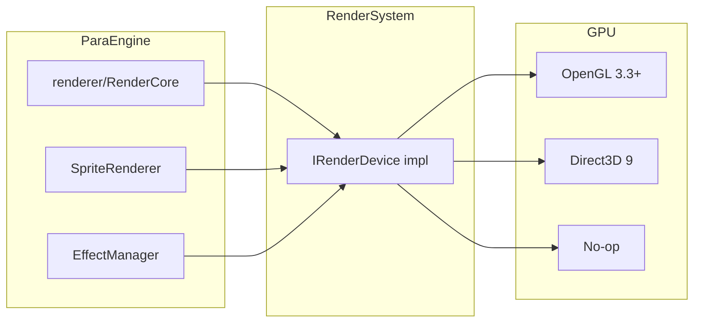

# Render System

The RenderSystem layer provides swappable GPU backends for ParaEngine. It implements the `IRenderDevice` interface consumed by `ParaEngine/renderer/`.

**Router:** `NPLRuntime/RenderSystem/CMakeLists.txt`

## Backend Selection

Controlled by CMake option `NPLRUNTIME_RENDERER`:

| Value | Subdirectory | CMake target | Use case |
|-------|--------------|--------------|----------|
| `OPENGL` | `opengl/` | `RenderSystemOpenGL` | Cross-platform client (default) |
| `DIRECTX` | `d3d9/` | `RenderSystemD3D9` | Legacy Windows client |
| `NULL` | `null/` | `RenderSystemNull` | Server / headless |

Server builds (`NPLRUNTIME_SERVER=ON`) force `NULL`.

Compile-time macros in ParaEngine:

- `USE_OPENGL_RENDERER`
- `USE_DIRECTX_RENDERER`

## Architecture



Access from engine code:

```cpp
IRenderDevice* device = CGlobals::GetRenderDevice();
```

Never call OpenGL or D3D APIs directly outside `RenderSystem/` and `OpenGLWrapper/`.

---

## OpenGL Backend

**Path:** `NPLRuntime/RenderSystem/opengl/`

| Class / File | Role |
|--------------|------|
| `RenderDeviceOpenGL` | Main device: context, state, draw calls |
| `RenderContextOpenGL` | Render target / context management |
| `VertexBufferOpenGL` | Vertex buffer objects |
| `IndexBufferOpenGL` | Index buffer objects |
| `gl_glad_spec.c` | GLAD loader (desktop) |
| `gl_ios_spec.c` | iOS OpenGL ES loader |
| `gl_android_spec.c` | Android GLES loader |
| `gl_harmonyos_spec.c` | HarmonyOS loader |
| `gl_osx_spec.c` | macOS loader |

### Dependencies

Links: **glad**, **freetype**, **GLSLCodeGen**, **fxParser**, **ParaEngine**.

OpenGL 3.3+ core profile on desktop; OpenGL ES on mobile.

### Shader pipeline

HLSL-like `.fx` files in `ParaEngine/shaders/` are translated to GLSL via `fxParser` and `GLSLCodeGen` externals.

---

## DirectX 9 Backend

**Path:** `NPLRuntime/RenderSystem/d3d9/`

| Class / File | Role |
|--------------|------|
| `RenderDeviceD3D9` | IDirect3DDevice9 wrapper |
| `VertexBufferD3D9` | D3D vertex buffers |
| `IndexBufferD3D9` | D3D index buffers |
| `D3DMapping` | State mapping helpers |

### Characteristics

- Shader Model 3.0 maximum
- Fixed-function pipeline still present in legacy code paths
- `.fx` / `.fxo` shaders compiled and embedded at build time
- Requires DirectX 9 SDK on Windows

DirectX-only engine features (`ParaEngine/Engine/`, `VoxelMesh/`, `CadModel/`, HTML browser) compile only with this backend.

---

## Null Backend

**Path:** `NPLRuntime/RenderSystem/null/`

| Class | Role |
|-------|------|
| `RenderDeviceNull` | Stub device — all draw calls no-op |
| `RenderContextNull` | Stub context |

Used by `ParaEngineServer` and any headless build. Allows the full ParaEngine + NPL stack to run without GPU drivers.

---

## Device Lifecycle

All backends implement the standard four-phase lifecycle invoked from `CParaEngineAppBase`:

```
InitDeviceObjects()       — create GPU resources
RestoreDeviceObjects()    — restore after device reset / context recreate
InvalidateDeviceObjects() — release before device loss
DeleteDeviceObjects()     — final cleanup
```

Asset types holding GPU data (textures, vertex buffers, effects) hook these via the asset manager and restore automatically on context recreation.

Platform-specific triggers:

| Platform | Device loss scenario |
|----------|---------------------|
| Windows (D3D9) | `D3DERR_DEVICENOTRESET`, alt-tab, resize |
| Windows (OpenGL) | Context recreate on window resize |
| Mobile | App pause/resume (`OnPause` / `OnResume`) |
| Emscripten | WebGL context loss |

---

## Render Pipeline (Client Frame)

```
CParaEngineAppBase::Render()
  └── CViewportManager — for each active viewport
        └── CSceneObject::Draw()
              └── renderer/RenderCore batch submission
                    └── IRenderDevice::*Draw*()
                          └── RenderSystem backend
  └── CGUIRoot::Draw()  — 2D overlay
```

`CalculateRenderTime()` in app base decides whether the current tick produces a rendered frame (FPS limiting, focus-based throttling).

---

## 2D Rendering

`ParaEngine/renderer/SpriteRenderer*.cpp` batches 2D sprites and quads.

`PaintEngine/` provides immediate-mode 2D drawing (lines, fills, text).

Both route through the same `IRenderDevice`.

---

## Effects and Shaders

| Backend | Shader format | Processing |
|---------|---------------|------------|
| DirectX | HLSL `.fx` → `.fxo` | Compiled at build, embedded as resources |
| OpenGL | HLSL-like `.fx` | Translated to GLSL at load via fxParser |

`EffectManager` (in asset system) loads and caches effect files.

---

## Font Rendering

FreeType rasterizes glyphs → uploaded as texture atlas → drawn as quads via sprite renderer.

`SpriteFontEntity` in asset manager handles font cache.

---

## Platform GL Context Creation

OpenGL context is created by Platform layer, not RenderSystem:

| Platform | Context creator |
|----------|-----------------|
| Windows | WGL via `Platform/Windows/` or SDL |
| Linux SDL | SDL_GL_CreateContext |
| iOS | EAGLContext |
| Android | EGL surface |
| Emscripten | WebGL via SDL2 |
| HarmonyOS | Native GL surface |

RenderSystem receives an initialized context and loads function pointers via platform-specific GLAD spec files.

---

## Emscripten / WebGL

Emscripten builds use OpenGL backend with WebGL 2 (when available).

CMake flags (`NPLRuntime/CMakeLists.txt`):

```
-sUSE_SDL=2 -sUSE_ZLIB=1 -sUSE_LIBJPEG=1 -sUSE_LIBPNG
-sALLOW_MEMORY_GROWTH -sNO_DISABLE_EXCEPTION_CATCHING
```

Multithreaded: `-pthread -sPTHREAD_POOL_SIZE=32`

Single-threaded (`EMSCRIPTEN_SINGLE_THREAD`): no pthread; coroutine-based NPL threading.

Web deployment requires COOP/COEP headers for SharedArrayBuffer in multithreaded mode.

---

## Choosing a Backend

| Scenario | Recommended |
|----------|-------------|
| Cross-platform desktop | OPENGL + SDL (`ParaCraftSDL2`) |
| Windows legacy / Paracraft | OPENGL (current default) or DIRECTX |
| Linux server | NULL |
| Mobile | OPENGL (GLES) |
| Web | OPENGL (WebGL via Emscripten) |
| CI / automated tests | NULL |

---

## Related Interfaces

**Path:** `ParaEngine/Framework/Interface/Render/`

| Interface | Role |
|-----------|------|
| `IRenderDevice` | Draw calls, state, caps |
| `IRenderWindow` | Window/surface abstraction |
| `IVertexBuffer` / `IIndexBuffer` | Geometry buffers |
| `ITexture` | GPU texture handle |

---

## Related

- [architecture.md](architecture.md) — render pipeline in frame loop
- [paraengine-subsystems.md](paraengine-subsystems.md) — renderer/ and asset GPU resources
- [platform.md](platform.md) — GL context creation per OS
- [build-system.md](build-system.md) — `NPLRUNTIME_RENDERER` option
