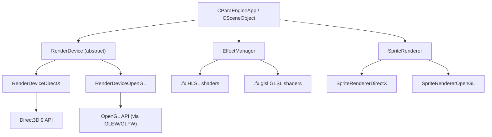

# Renderer

ParaEngine uses a compile-time renderer backend selection with a unified abstract interface. The two backends are **DirectX 9** (Windows) and **OpenGL** (Linux, macOS, mobile).

## Backend Selection

Set via CMake option `NPLRUNTIME_RENDERER`:

| Value | Platform | Defines |
|-------|----------|---------|
| `DIRECTX` | Windows | `USE_DIRECTX_RENDERER` |
| `OPENGL` | Linux, macOS, mobile | `USE_OPENGL_RENDERER` |

Default: `DIRECTX` on Windows, `OPENGL` on macOS.

## Architecture



## Core Components

### RenderDevice (Abstract)

`renderer/RenderDevice.h` — Unified rendering interface.

Provides D3D-style enums and methods that both backends implement:
- Device creation and reset
- Render target management
- Depth/stencil buffers
- Viewport and scissor
- Draw calls (indexed, non-indexed)
- State management (blend, depth, rasterizer)
- Texture binding
- Vertex/index buffer management

Access: `CParaEngineApp::GetRenderDevice()`

### DirectX Backend

| File | Role |
|------|------|
| `RenderDeviceDirectX.h/.cpp` | D3D9 device implementation |
| `RenderCore.h` | Includes `dxstdafx.h`, D3D types |
| `effect_file_DirectX.h/.cpp` | HLSL effect file loading |
| `SpriteRendererDirectX.h/.cpp` | 2D sprite batching |
| `TextureEntityDirectX.h` | D3D9 texture management |
| `ParaVertexBuffer.h` | D3D vertex buffers |
| `VertexDeclaration.h` | D3D vertex declarations |

Requirements: DirectX SDK (June 2010) on Windows.

### OpenGL Backend

| File | Role |
|------|------|
| `RenderDeviceOpenGL.h/.cpp` | OpenGL device implementation |
| `RenderCoreOpenGL.h` | OpenGL types and wrappers |
| `OpenGLWrapper.h` | OpenGL function loading |
| `effect_file_OpenGL.h/.cpp` | GLSL shader loading |
| `SpriteRendererOpenGL.h/.cpp` | 2D sprite batching |
| `TextureEntityOpenGL.h` | GL texture management |
| `GLFont.h`, `GLFontAtlas.h` | Font rendering |
| `GLTexture2D.h` | 2D texture wrapper |
| `VertexDeclarationOpenGL.h` | GL vertex attribute setup |

Dependencies: GLEW 2.1.0, GLFW 3.2.1 (in `Client/trunk/externals/`).

## Shader System

### DirectX Shaders (HLSL)

Location: `Client/trunk/ParaEngineClient/shaders/`

- Effect files: `.fx` (HLSL with technique/pass structure)
- Compiled offline: `.fx` → `.fxo` via `fxc` (DirectX shader compiler)
- CMake builds shaders as part of client build
- Embedded into binary via `embed-resource/` for server builds

Example structure:
```hlsl
// terrain.fx
technique TerrainRender {
    pass P0 {
        VertexShader = compile vs_2_0 TerrainVS();
        PixelShader = compile ps_2_0 TerrainPS();
    }
}
```

### OpenGL Shaders (GLSL)

Location: `Client/trunk/ParaEngineClient/shaders/glsl/`

- Converted from HLSL via **dx2gl** tool
- Files: `.fx.glsl` (combined vertex + fragment)
- Loaded at runtime by `effect_file_OpenGL`

### Effect Manager

`renderer/EffectManager.h/.cpp` — Manages shader/effect lifecycle:
- Load and cache effect files
- Set technique and pass
- Bind shader parameters (matrices, textures, constants)
- Backend-agnostic interface used by scene objects

## Sprite Rendering

`renderer/SpriteRenderer.h` — 2D sprite batching for GUI and 2D overlays.

Backend implementations batch quads for efficient draw calls:
- `SpriteRendererDirectX` — D3D9 DrawPrimitiveUP or vertex buffer batching
- `SpriteRendererOpenGL` — GL triangle batching

Used by `2dengine/` GUI widgets and 2D painting.

## Texture System

| Component | DirectX | OpenGL |
|-----------|---------|--------|
| Entity class | `TextureEntityDirectX` | `TextureEntityOpenGL` |
| Base | `TextureEntity.h` | `TextureEntity.h` |
| Formats | D3D9 formats (DXT, RGBA) | GL formats (DXT via extension, RGBA) |
| Loading | D3DXCreateTexture | glTexImage2D |

Textures are reference-counted via `AssetEntity<TextureEntity>`.

## Vertex Buffers

| Component | DirectX | OpenGL |
|-----------|---------|--------|
| Vertex buffer | `ParaVertexBuffer` | `ParaVertexBuffer` (GL buffer objects) |
| Declaration | `VertexDeclaration` | `VertexDeclarationOpenGL` |
| Index buffer | D3D index buffer | GL element buffer |

## Render Pipeline (Per Frame)

```
1. BeginScene()
   → Clear color/depth/stencil buffers
   → Set render targets

2. Render 3D Scene (CSceneObject::Render)
   a. Sky rendering (CSkyMesh)
   b. Terrain rendering (CGlobalTerrain)
   c. Shadow map generation (CSunLight → ShadowMap)
   d. Opaque objects (sceneRenderList, front-to-back)
   e. Transparent objects (back-to-front)
   f. Shadow volumes (stencil shadows)
   g. Post-processing effects

3. Render 2D Overlay
   → SpriteRenderer for GUI
   → 2dengine widgets

4. EndScene()
   → Present / SwapBuffers
```

## Render States

Managed per-object and globally:
- **Blend state:** Alpha blending modes
- **Depth state:** Z-test, Z-write
- **Rasterizer state:** Fill mode, cull mode
- **Sampler state:** Texture filtering, addressing

Scene-level state in `SceneState` (fog, ambient light, etc.).

## Batched Drawing

`Core/IBatchedElementDraw.h` / `CBatchedElementDraw` — Interface for batched debug/editor drawing (lines, boxes, text overlays).

## Embedded Resources

Server builds embed shaders and templates at compile time via `NPLRuntime/embed-resource/`:
- CMake templates generate C++ source with embedded binary data
- Allows server to run without external shader files

## Platform Notes

### Windows (DirectX)
- Requires DirectX SDK June 2010
- Static linking to d3d9, d3dx9
- Window creation via Win32 API or GLFW (OpenGL mode)
- `build_win32.bat` can auto-install DirectX SDK

### Linux (OpenGL)
- System OpenGL + GLEW
- GLFW for window creation (client)
- Server build may link OpenGL for shared code but doesn't create a context

### macOS (OpenGL)
- Native OpenGL framework
- GLFW for window creation
- LuaJIT 2.1 required (luabind 0.9.2beta)

## Key Files

```
renderer/
├── RenderDevice.h              # Abstract device interface
├── RenderDeviceDirectX.h/.cpp  # DirectX 9 backend
├── RenderDeviceOpenGL.h/.cpp   # OpenGL backend
├── RenderCore.h                # DirectX core types
├── RenderCoreOpenGL.h          # OpenGL core types
├── EffectManager.h/.cpp        # Shader management
├── effect_file.h               # Effect file interface
├── effect_file_DirectX.h/.cpp  # HLSL effects
├── effect_file_OpenGL.h/.cpp   # GLSL effects
├── SpriteRenderer.h            # Sprite interface
├── SpriteRendererDirectX.h/.cpp
├── SpriteRendererOpenGL.h/.cpp
├── ParaVertexBuffer.h          # Vertex buffers
├── VertexDeclaration.h         # DirectX declarations
├── VertexDeclarationOpenGL.h   # OpenGL declarations
├── OpenGLWrapper.h             # GL function loading
├── GLFont.h / GLFontAtlas.h   # OpenGL font rendering
└── GLTexture2D.h               # OpenGL 2D textures

shaders/
├── *.fx                        # HLSL effect files
└── glsl/*.fx.glsl              # GLSL converted shaders
```
