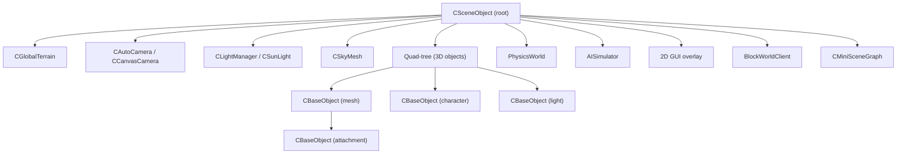

# Scene Graph & 3D Engine

The 3D engine lives in `Client/trunk/ParaEngineClient/3dengine/` (~195 source files) with supporting subsystems in `terrain/`, `BlockEngine/`, `VoxelMesh/`, and `ParaXModel/`.

## Scene Graph Architecture



### CSceneObject — Scene Root

`3dengine/SceneObject.h` — The single most important class. Manages all game objects in a tree hierarchy.

The root is **flat** (terrain, camera, physics, sky, quad-tree as direct children) but child nodes can be **deep** (character attachments, nested groups).

Key responsibilities:
- Global scene state (fog, shadows, debug info)
- Object culling and render list generation
- Ray picking and selection
- Camera pool management
- Mini scene graphs (handles, particles, 3D cursors)
- Frame move and draw orchestration

Access: `CSceneObject::GetInstance()` (may return NULL if never created).

### CBaseObject — Scene Node Base

`3dengine/BaseObject.h` — Base class for all scene objects.

Features:
- **Volume attributes:** sensor, container, freespace (for AI/collision)
- **Hierarchy:** parent/child attachment, transform inheritance
- **Scripting hooks:** per-object NPL event handlers
- **View culling:** frustum and distance culling
- **Type system:** `CObjectType<T>` template for runtime type identification

All game objects derive from `CBaseObject` and implement `IGameObject`.

### Object Type Hierarchy

| Type | Class | Purpose |
|------|-------|---------|
| Scene root | `CSceneObject` | Top-level manager |
| Mesh | `CMeshObject`, `CMeshEntity` | Static/skinned meshes |
| Character | `ParaXAnimInstance`, `CustomCharModelInstance` | Skeletal animated characters |
| Camera | `CBaseCamera`, `CAutoCamera`, `CCanvasCamera` | View cameras |
| Light | `CLightObject`, `CSunLight` | Scene lighting |
| Sky | `CSkyMesh` | Sky dome/box |
| Overlay | `COverlayObject` | 2D-in-3D overlays |
| Missile | `CMissileObject` | Projectile objects |
| Mini scene | `CMiniSceneGraph` | Lightweight overlay scenes |
| Shadow | `ShadowVolume` | Stencil shadow volumes |

## Cameras

| Class | File | Role |
|-------|------|------|
| `CBaseCamera` | `3dengine/BaseCamera.h` | Abstract camera with frustum |
| `CAutoCamera` | `3dengine/AutoCamera.h` | Automatic follow/orbit camera |
| `CCanvasCamera` | `3dengine/CanvasCamera.h` | Fixed canvas/orthographic camera |

Camera pool managed by `CSceneObject`. Lua API: `ParaCamera` namespace.

## Lighting

| Class | Role |
|-------|------|
| `CLightManager` | Manages all scene lights |
| `CLightObject` | Point/spot/directional light |
| `CSunLight` | Directional sun with shadow mapping |
| `LightParam` | Light parameter struct |

Shadow rendering:
- `ShadowVolume` — stencil shadow volumes
- `ShadowMap` — shadow map rendering
- `DropShadowRenderer` — character drop shadows

## Animation System

Located in `ParaXModel/` and `3dengine/`:

| Component | Role |
|-----------|------|
| `ParaXEntity` | Loaded ParaX model asset |
| `ParaXAnimInstance` | Runtime animation instance |
| `CustomCharModelInstance` | Customizable character with bone controllers |
| `ColladaModelLoader` | FBX/Collada import via Assimp |
| `glTFModelExporter` | glTF export |
| Bone controllers | IK, look-at, procedural animation |

Animation pipeline:
```
Asset file (.x, .fbx, .gltf)
    → AssetManager::LoadParaX()
    → ParaXEntity (meshes, skeleton, animations)
    → ParaXAnimInstance (runtime playback)
    → Bone transforms → skinning → GPU
```

## Terrain System

Located in `terrain/` and integrated via `ParaTerrain::CGlobalTerrain`:

| Component | Role |
|-----------|------|
| `CGlobalTerrain` | Large-scale terrain manager |
| `CTerrainTile` | Individual terrain tile with heightmap |
| `TerrainGeoMipmapIndices` | LOD index buffers |
| `TerrainFilters` | Heightmap filters (smooth, erode, etc.) |
| Texture factories | Detail texture splatting |

Features:
- Geo-mipmapped LOD
- Dynamic tile loading/unloading
- Height map editing
- Texture splatting (multi-layer terrain textures)
- Environment simulation integration

Lua API: `ParaTerrain` namespace.

## Block Engine (Voxel World)

Located in `BlockEngine/` — Minecraft-style block world:

| Component | Role |
|-----------|------|
| `BlockWorldClient` | Client-side block world view |
| `BlockChunk` | 16×16×16 chunk of blocks |
| `BlockModelProvider` | Block mesh generation |
| `StairModelProvider` | Stair/slab geometry |

Integrated with `CSceneObject` and exposed via `ParaBlockWorld` Lua namespace.

## Voxel Mesh

Located in `VoxelMesh/` — alternative voxel terrain:

| Component | Role |
|-----------|------|
| `VoxelTerrainManager` | Voxel terrain lifecycle |
| `IsoSurfaceBuilder` | Marching cubes / isosurface extraction |
| Metaball meshing | Smooth voxel surfaces |

## Physics

| Component | File | Role |
|-----------|------|------|
| `PhysicsWorld` | `3dengine/PhysicsWorld.h` | Physics world manager |
| `ParaPhysics` | `3dengine/ParaPhysics.h` | Physics interface |
| `PhysicsBT` plugin | `Client/trunk/PhysicsBT/` | Bullet3 integration |

Physics is optional (CMake: `NPLRUNTIME_PHYSICS`). When enabled, the Bullet3 plugin provides:
- Rigid body dynamics
- Collision detection
- Ray casting
- Character controllers

## Environment & Weather

| Component | Role |
|-----------|------|
| `CEnvironmentSim` | Environment/collision simulation |
| `EnvironmentSim` | Weather, wind, day/night |
| Ocean rendering | Water surface simulation |
| Fog | Distance fog (managed by scene) |

## Selection & Picking

| Component | Role |
|-----------|------|
| `SelectionManager` | Object selection state |
| Ray picking | `CSceneObject` ray-object intersection |
| `IObjectDrag` | Drag-and-drop interface |

Lua API: `ParaSelection` namespace.

## Asset Management

`Core/AssetManager.h` — Central asset loading and caching:

```cpp
// Load a ParaX model
AssetEntity<ParaXEntity>* pModel = 
    CGlobals::GetAssetManager()->LoadParaX("models/character.x");
pModel->addref();
// ... use model
pModel->Release();
```

Asset types: textures, ParaX models, effects, fonts, audio.

Reference counting via `AssetEntity<T>` — always pair `addref()` with `Release()`.

## Scene Rendering Pipeline

Per-frame rendering flow:

```
CParaEngineApp::FrameMove()
    → CSceneObject::FrameMove()
        → Update animations, physics, AI
        → Process terrain LOD
    → CSceneObject::Render()
        → Build sceneRenderList (culling)
        → Render sky, terrain, opaque objects
        → Render transparent objects
        → Render shadows, post-effects
        → Render 2D GUI overlay
```

Render state tracked in `SceneState` (`3dengine/SceneState.h`).

## Mini Scene Graph

`CMiniSceneGraph` — lightweight overlay scene for:
- 3D manipulation handles
- Particle effect previews
- 3D cursor indicators
- Editor gizmos

Separate from the main scene graph to avoid polluting the primary render list.

## Auto Rigger

`AutoRigger/` — Automatic character skeleton generation:
- Uses PCL (Point Cloud Library) and Pinocchio
- Maps mesh vertices to skeleton bones
- Integrated as optional server-side feature

## Related Subsystems

| Directory | Integration |
|-----------|-------------|
| `2dengine/` | GUI rendered as overlay on 3D scene |
| `PaintEngine/` | 2D painting on textures/canvas |
| `Framework/` | Input system feeds into scene interaction |
| `BMaxModel/` | Blender model import pipeline |
| `CadModel/` | CAD model import |
| `mdxfile/` | Legacy MDX model support |

## Creating Custom Scene Objects

```cpp
class MyObject : public CBaseObject {
public:
    virtual HRESULT Draw(SceneState* sceneState) override {
        // Render logic
        return S_OK;
    }
    virtual CBaseObject::_SceneObjectType GetType() {
        return CBaseObject::CustomObject;
    }
    static CObjectType<MyObject> g_type;
};

// Attach to scene
MyObject* obj = new MyObject();
obj->SetPosition(DVector3(0, 0, 0));
CSceneObject::GetInstance()->AttachObject(obj);
```

## Key Files Reference

```
3dengine/
├── SceneObject.h / .cpp          # Scene root
├── BaseObject.h / .cpp           # Node base class
├── IGameObject.h                 # Game object interface
├── IScene.h                      # Scene interface
├── SceneState.h                  # Per-frame render state
├── BaseCamera.h, AutoCamera.h    # Cameras
├── LightManager.h, SunLight.h    # Lighting
├── ShadowMap.h, ShadowVolume.h   # Shadows
├── ParaXAnimInstance.h           # Animation instances
├── PhysicsWorld.h, ParaPhysics.h # Physics
├── EnvironmentSim.h              # Environment
├── SelectionManager.h            # Picking/selection
├── MiniSceneGraph.h              # Overlay scenes
└── AttributeProvider.h           # Object attributes
```
